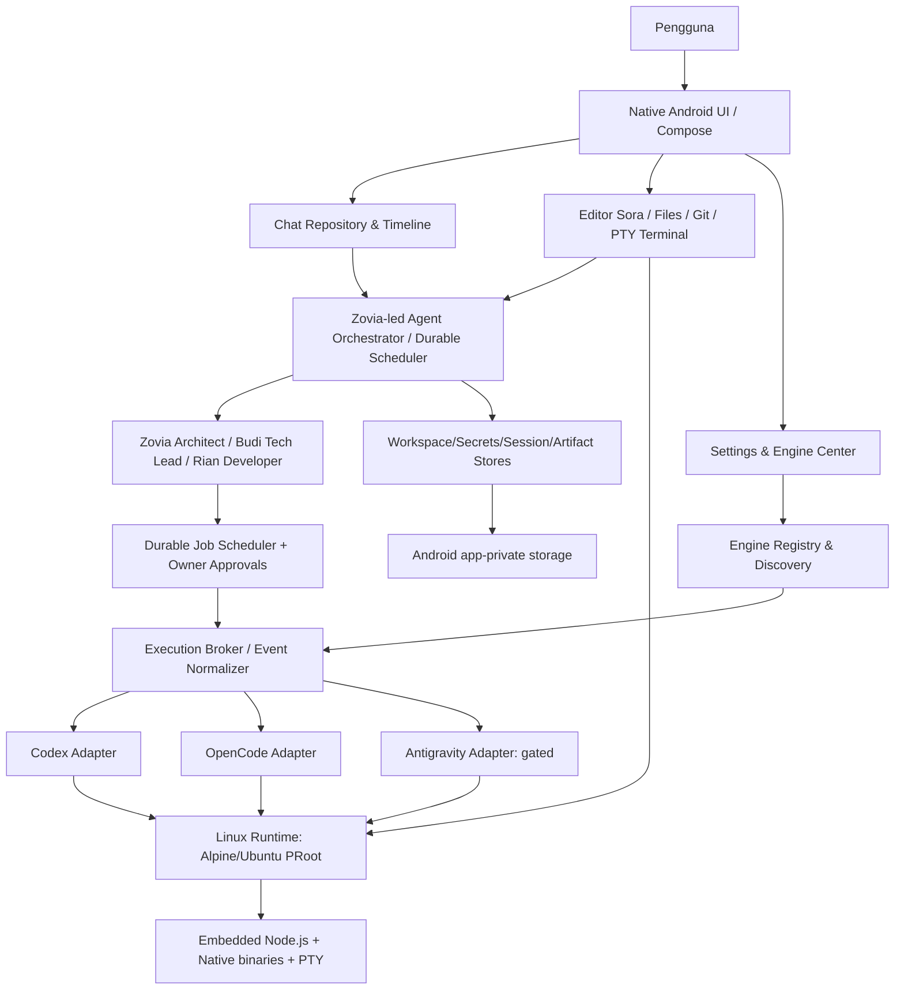
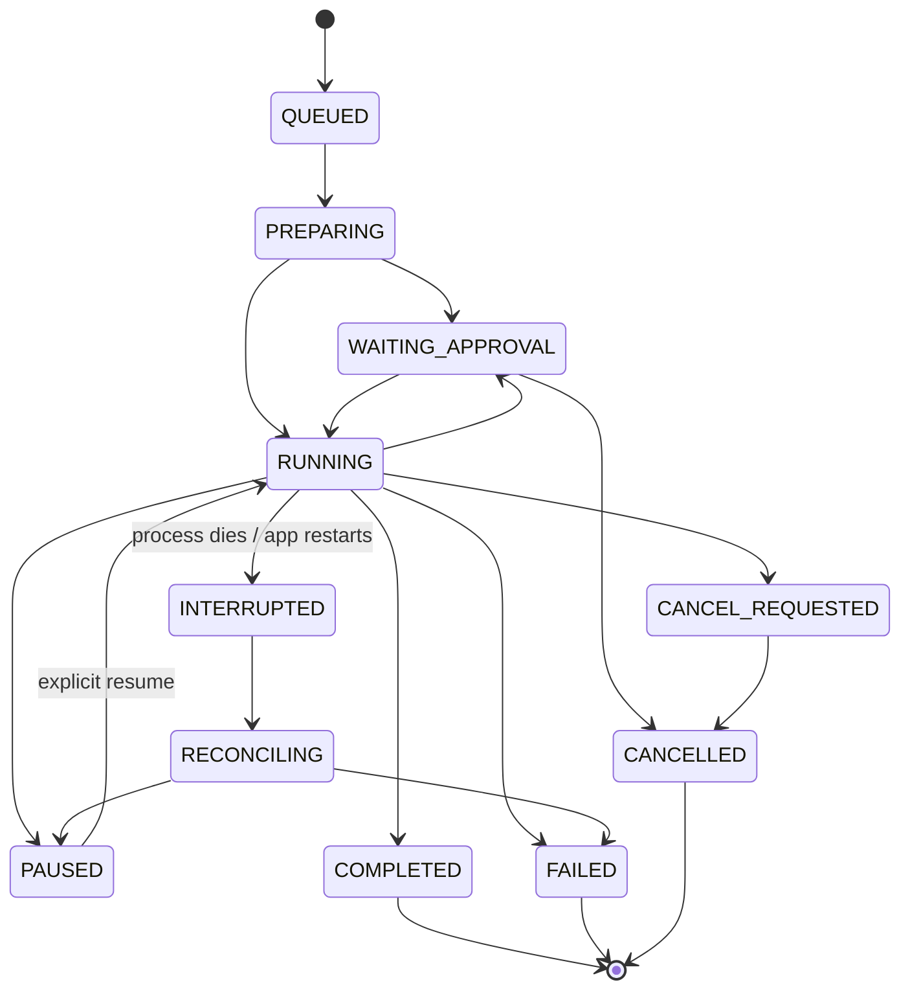
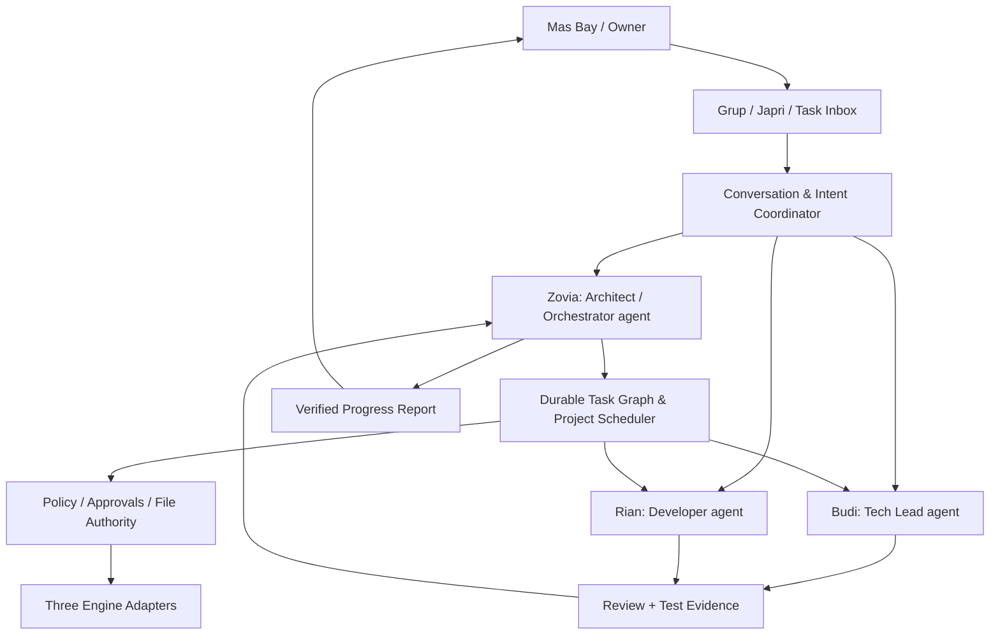
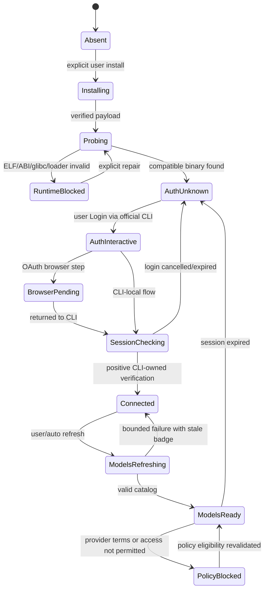
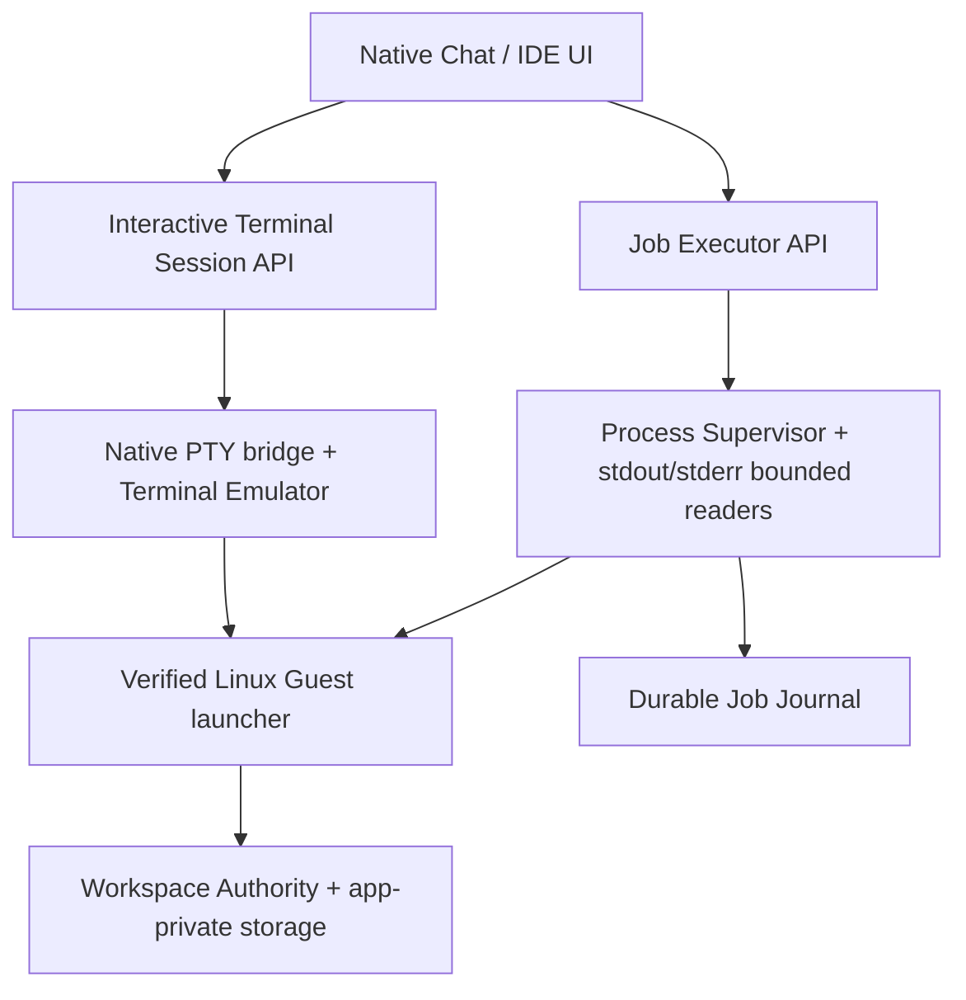
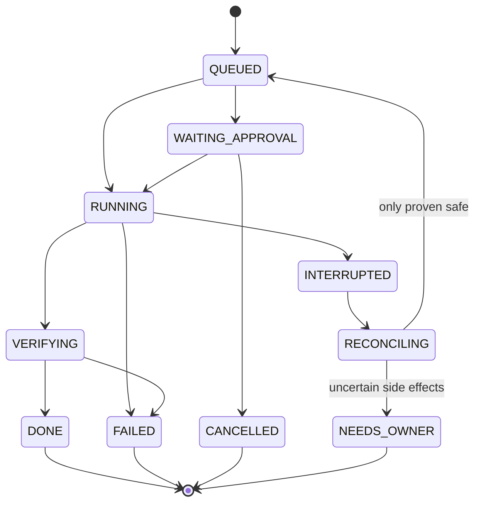
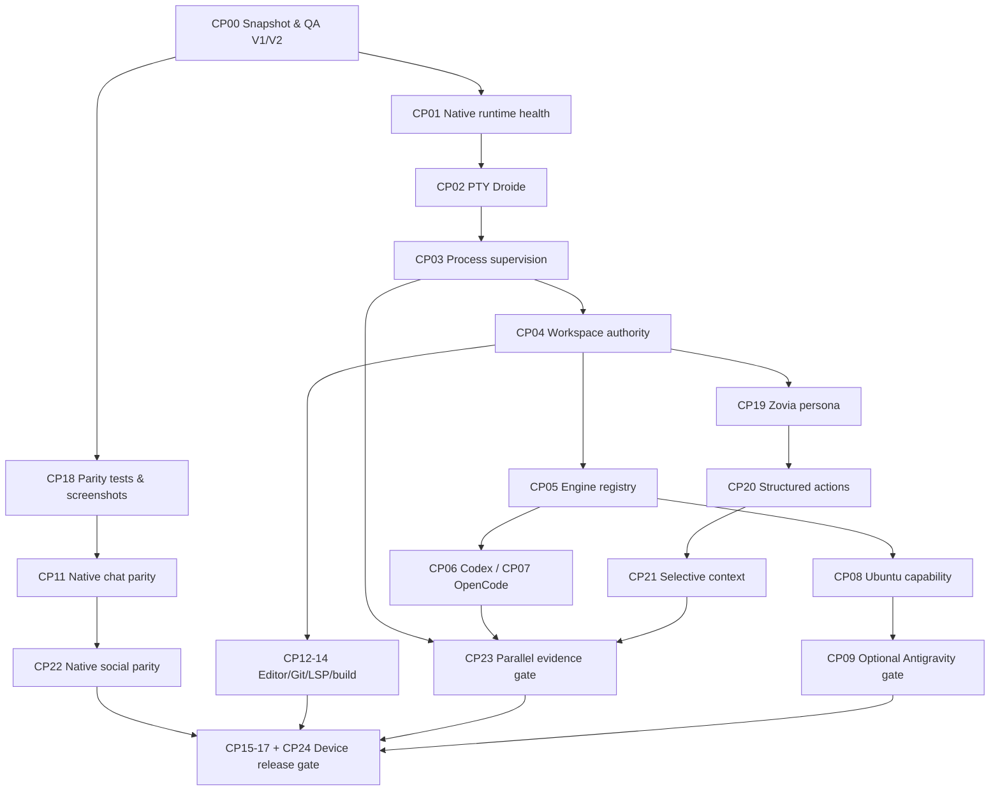

# WHATSAPP AGENT V2
## Master Blueprint: Native Android Agentic IDE & Personal Linux Workstation

> **Status implementasi hidup:** [CHECKPOINT_TRACKER.md](CHECKPOINT_TRACKER.md) · [SESSION_HANDOFF.md](SESSION_HANDOFF.md)

> **CP00/CP18/CP19/CP20 status saat ini (lihat tracker):** ✅ source baseline+hash dikunci; ✅ inventaris 26 fitur V1 dan source-symbol tests; ✅ Zovia PERSONA + registry + deny-gate + storage privat teruji; ✅ action schema *pending* dengan validasi dan idempotensi teruji. **Belum DONE secara keseluruhan:** Zovia live, authenticated room API, real action dispatch, PTY Android, APK/device QA, dan izin Antigravity. Centang ini menandakan subtask dengan bukti, **bukan** sertifikasi CP atau rilis.


**Produk:** WhatsApp Agent V2 — Zovia, Budi, Rian, dan Mas Bay (Owner)
**Pengembang:** BayStudio / BayZov
**Sasaran:** aplikasi pribadi Android, **satu APK mandiri**, tidak bergantung pada Termux atau terminal eksternal
**Dokumen:** Master Architecture Blueprint v2.0 — REVISI TERPADU (V1 Feature-Parity + Multi-Agent 3 Persona + Droide)
**Tanggal:** 8 Oktober 2026
**Status:** **ARSITEKTUR TARGET / IMPLEMENTATION PLAN**, bukan bukti build/QA Android. Semua tingkat kesiapan harus dinyatakan per-komponen.
**Sumber referensi:** V1 GitHub, baseline V2 GitHub, Droide v1.00 source UI/editor fixed (arsip 2026-10-08), dan dokumentasi resmi pada bagian akhir

> **Kalimat produk:** Berkomunikasi dengan tim agent semudah WhatsApp; mengerjakan, membangun, memeriksa, dan mengirim perangkat lunak semampu IDE profesional, seluruhnya dari HP.

### Ringkasan Eksekutif Revisi v2.0

**Perubahan terbesar dari blueprint v1.0:** sekarang ada **tiga agent (Zovia, Budi, Rian)** dengan Owner sebagai pemutus akhir; V1 social experience dikunci melalui **26 feature-parity gates** dari screenshot nyata; memori grup/japri dibagikan **selektif**; klaim bekerja harus punya **action receipt dan evidence**; tiga engine tetap hidup mandiri; dan seluruh kemampuan kerja IDE menggunakan **native Android + Linux internal tanpa Termux eksternal**. Roadmap dasar CP00–CP17 dipertahankan dengan tambahan CP18–CP24.

**Garis merah implementasi:** jangan menyebut desain sebagai fitur siap, jangan mengklaim API/provider tersedia hanya dari model list statis, jangan membocorkan konteks japri, jangan mengaku memantau/build/commit tanpa log+exit code, jangan menjadikan Antigravity optional sebagai blocker seluruh aplikasi, dan jangan merombak desain WhatsApp V1 tanpa persetujuan pemilik.

**Build-ready ≠ APK-ready ≠ Feature-ready.** Status keluaran wajib: `SOURCE`, `PROTOTYPE`, `COMPILED`, `DEVICE-TESTED`, `BLOCKED`, atau `RELEASE-READY` sesuai bukti per checkpoint. Semua angka performa dalam dokumen adalah target pengukuran, bukan klaim hasil.

---

## Implementasi CP00–CP24 (sumber: [tracker](CHECKPOINT_TRACKER.md))

Status per checkpoint adalah **ringkasan bukti implementasi**, bukan klaim semua checkpoint sudah lulus. Centang ✅ mengacu pada subtask di tracker dan tes yang dijalankan; seluruh CP tetap dianggap belum diterima sampai semua gate termasuk Android QA lulus.

| CP | Status keseluruhan | Subtask yang punya bukti / yang masih tertunda |
|---|---|---|
| CP00 | 🟡 Sebagian | ✅ baseline SHA/hash + repeatable QA; ⬜ Android baseline build |
| CP01 | ⬜ Belum lulus gate | Lihat target terperinci di tabel roadmap dan tracker |
| CP02 | ⬜ Belum di branch | Prototipe PTY Droide ada di worktree QA lain, belum merge dan belum uji Android |
| CP03 | ⬜ Belum lulus gate | Lihat target terperinci di tabel roadmap dan tracker |
| CP04 | ⬜ Belum lulus gate | Lihat target terperinci di tabel roadmap dan tracker |
| CP05 | ⬜ Belum lulus gate | Lihat target terperinci di tabel roadmap dan tracker |
| CP06 | ⬜ Belum lulus gate | Lihat target terperinci di tabel roadmap dan tracker |
| CP07 | ⬜ Belum lulus gate | Lihat target terperinci di tabel roadmap dan tracker |
| CP08 | ⬜ Belum lulus gate | Lihat target terperinci di tabel roadmap dan tracker |
| CP09 | ⬜ Belum lulus gate | Lihat target terperinci di tabel roadmap dan tracker |
| CP10 | ⬜ Belum lulus gate | Lihat target terperinci di tabel roadmap dan tracker |
| CP11 | ⬜ Belum lulus gate | Lihat target terperinci di tabel roadmap dan tracker |
| CP12 | ⬜ Belum lulus gate | Lihat target terperinci di tabel roadmap dan tracker |
| CP13 | ⬜ Belum lulus gate | Lihat target terperinci di tabel roadmap dan tracker |
| CP14 | ⬜ Belum lulus gate | Lihat target terperinci di tabel roadmap dan tracker |
| CP15 | ⬜ Belum lulus gate | Lihat target terperinci di tabel roadmap dan tracker |
| CP16 | ⬜ Belum lulus gate | Lihat target terperinci di tabel roadmap dan tracker |
| CP17 | ⬜ Belum lulus gate | Lihat target terperinci di tabel roadmap dan tracker |
| CP18 | 🟡 Sebagian | ✅ 26 fitur V1 diinventaris + tes simbol; ⬜ Android golden fixtures |
| CP19 | 🟡 Sebagian | ✅ Zovia persona, ACL helpers, store privat + tes; ⬜ auth/API/UI live |
| CP20 | 🟡 Sebagian | ✅ pending action schema + idempotency tests; ⬜ real dispatch/receipt |
| CP21 | ⬜ Belum lulus gate | Lihat target terperinci di tabel roadmap dan tracker |
| CP22 | ⬜ Belum lulus gate | Lihat target terperinci di tabel roadmap dan tracker |
| CP23 | ⬜ Belum lulus gate | Lihat target terperinci di tabel roadmap dan tracker |
| CP24 | ⬜ Belum lulus gate | Lihat target terperinci di tabel roadmap dan tracker |

Dokumen sumber progres lintas sesi: [✅ CHECKPOINT_TRACKER.md](CHECKPOINT_TRACKER.md), [SESSION_HANDOFF.md](SESSION_HANDOFF.md), [checkpoints/INDEX.md](../checkpoints/INDEX.md).

## Daftar isi

1. [Visi, produk, dan batasan](#bagian-i--visi-produk--batasan)
2. [Arsitektur sistem](#bagian-ii--arsitektur-sistem)
3. [Runtime dan workstation](#bagian-iii--runtime--workstation)
4. [Multi-engine: Antigravity, OpenCode, Codex](#bagian-iv--multi-engine-antigravity-opencode-codex)
5. [Orchestrator, streaming, dan parallel jobs](#bagian-v--agent-orchestration-streaming--parallelism)
6. [UI/UX WhatsApp sebagai IDE](#bagian-vi--uiux-whatsapp-sebagai-ide)
7. [Integrasi teknologi Droide](#bagian-vii--teknologi-droide-yang-dipindahkan)
8. [Penyimpanan, privasi, dan mitigasi error](#bagian-viii--data-storage-privacy--safety)
9. [Roadmap checkpoint dan QA](#bagian-ix--roadmap-terstruktur--checkpoint)
10. [Strategi migrasi V1 ke V2](#bagian-x--migration-plan-v1--v2)
11. [Prioritas dan keputusan arsitektur](#bagian-xi--priority--decisions--done)
12. [Referensi dan handoff implementasi](#bagian-xii--referensi-risiko-dan-handoff)
13. [Kontrak persona Zovia–Budi–Rian & koordinasi kerja](#bagian-xiii--trio-agent-kontrak-organisasi--hak-akses)
14. [V1 parity: sosial WhatsApp, media, panggilan, dan bukti tindakan](#bagian-xiv--kontrak-feature-parity-v1-dan-social-runtime)
15. [Sumber kebenaran data, memori selektif, privacy chat](#bagian-xv--data-model-konteks--privasi-grup-dan-japri)
16. [Tiga engine: readiness, autentikasi, instalasi, model discovery](#bagian-xvi--three-engine-readiness-dan-provider-gates)
17. [Native IDE Droide: editor, terminal, VFS, toolchain](#bagian-xvii--droide-to-whatsapp-agent-integrasi-tingkat-produksi)
18. [Arsitektur reliability, QA, dan device gates](#bagian-xviii--reliability-observability--quality-gates)
19. [Roadmap tambahan, migrasi, ADR, dan handoff](#bagian-xix--roadmap-penyempurnaan-migrasi--serah-terima)

---

## 0. Cara membaca dokumen & status kebenaran

Gunakan label berikut agar fitur yang diusulkan tidak diklaim sudah selesai:

- **[V1]**: ditemukan pada source V1 GitHub; keberadaan kode **tidak otomatis berarti lulus uji perangkat**.
- **[V2]**: ditemukan pada baseline V2 GitHub; tetap memerlukan bukti runtime sesuai fitur.
- **[DROIDE]**: pola/komponen yang diamati pada ZIP Droide yang diberikan; pemindahan memerlukan integrasi, verifikasi, dan atribusi.
- **[TARGET]**: kemampuan yang akan dibangun. **[GATE]**: syarat sebelum dianggap siap.
- **[PROTOTYPE]**: perubahan lokal/branch QA terpisah yang belum diintegrasikan ke `main`.
- **[OBSERVED]**: perilaku yang terlihat di screenshot/runtime V1, tetapi belum membuktikan backend melakukan kerja yang diklaim.
- **[BLOCKED]**: pekerjaan menunggu syarat teknis, kompatibilitas, atau izin penyedia.

**Garis dasar yang diverifikasi saat perancangan:**

| Area | V1 awal/terkini | Baseline V2 | Sasaran V2 final |
|---|---|---|---|
| Antarmuka | Chat WhatsApp-style berbasis web | Chat web dalam host Android | Native Android chat-first IDE dengan identitas visual chat tetap familiar |
| Persona | Budi & Rian, grup/japri/peer | Persona & chat backend, belum Zovia | **Zovia (Architect/Orchestrator) + Budi (Tech Lead) + Rian (Developer)**, workspaces/permissions terpisah |
| Engine AI | `agy`, `opencode`, `codex` via proses CLI | Managed Codex & OpenCode; Antigravity sengaja tidak dikelola | 3 slot adapter; Codex/OpenCode managed; Antigravity user-installed & **aktivasi otomatis hanya bila sesuai izin/ketentuan** |
| Terminal | TUI/overlay, stream non-PTY penuh | Internal overlay berbasis stream | Native PTY terminal Android, akses shell Linux app-private |
| Runtime | Node.js host / installer eksternal untuk jalur web | Embedded Node JNI, Alpine/PRoot, paket engine bertahap | Node/PRoot/PTY mandiri; Ubuntu ARM64 opsional untuk glibc |
| Editor | Syntax-highlighted snippets | Belum editor IDE matang | Sora code editor + tabs, LSP, diagnostic, Git diff |
| Eksekusi | Proses CLI dan output agregat | Pemetaan engine ke Linux internal | Structured streaming, checkpoint, cancel, lease, resume |
| Model | Daftar sebagian hardcoded | Pilihan berbasis engine | Discovery aktual, cache, fallback aman/terlihat |
| Testing | Smoke checks parsial | CI Android + runtime smoke terencana | CI + emulator + perangkat fisik + failure injection |

**Aktivitas prototipe saat audit:** integrasi PTY dari Droide pernah mulai dikerjakan pada *branch QA lokal terisolasi* untuk V2, dan pengujian provenance/host PTY lulus. **Kompilasi APK, instalasi di HP, dan operasi PTY di Android belum terbukti lulus**. Blueprint ini tidak menganggap pekerjaan prototipe tersebut sudah masuk `main`.

### 0.1 Hasil yang disebut 'selesai'

Sebuah kemampuan disebut **DONE** hanya jika: source ter-commit di jalur rilis, test relevan hijau, dijalankan pada APK bersih, perilaku diamati, bukti/log tersimpan, dan tidak memperkenalkan regresi pada chat, terminal, atau workspace.

---

# BAGIAN I — VISI, PRODUK, & BATASAN

## 1. Prinsip produk non-negotiable

1. **APK Android utuh.** UI, service, PTY, dan runtime inti disediakan oleh aplikasi. Terminal eksternal bukan dependency.
2. **Chat-first.** Grup Zovia/Budi/Rian tetap beranda utama; alat IDE ada dalam jangkauan tanpa menjadikan UI mirip dashboard AI generik.
3. **Kerja sungguhan.** Bukan simulasi agent, dummy terminal, log palsu, atau label engine yang belum siap.
4. **Local-first.** Source, riwayat, direktori `.git`, token, file `.env`, dan proyek tidak dikirim diam-diam. Network access hanya untuk layanan yang dipilih/diizinkan.
5. **Tiga engine, tiga lifecycle independen.** Kegagalan satu engine tidak menjatuhkan chat, terminal, atau agent lain.
6. **Source of truth tunggal.** Chat, Settings, terminal, file explorer, dan orchestrator membaca state engine/workspace dari registry yang sama.
7. **No silent fallback.** Jika model/engine gagal, tampilkan sebab dan pilihan eksplisit; jangan beralih penyedia tanpa izin.
8. **Crash containment.** Backend dan proses CLI terisolasi; tidak menaruh operasi blocking di main thread Android.
9. **No duplicate execution.** Setelah timeout/restart, jangan otomatis mengeksekusi ulang command mutasi tanpa bukti aman.
10. **Semua progres dapat diverifikasi.** UI progress mencerminkan event nyata dan memiliki jalur gagal/ulang/cancel.
11. **Izin manusia untuk tindakan berisiko.** Hindari flag bypass permission/sandbox sebagai pengaturan default.
12. **Kepribadian dan identitas UI WhatsApp-style**, tetapi kode, merek, aset, dan tampilan pihak ketiga harus digunakan sesuai haknya.

## 2. Persona & skenario penggunaan

- **Mas Bay, Owner:** manusia pemilik dan keputusan akhir, dapat berpartisipasi di grup, japri, dan meninjau pekerjaan.
- **Zovia, Software Architect & Orchestrator:** agent **ketiga**, memetakan requirement, membagi tugas, memantau evidence, mereview hasil, dan meminta keputusan Owner; bukan pengganti izin manusia.
- **Budi, Tech Lead / Senior Software Engineer:** formal, sopan, bertanggung jawab; rancangan teknis, code review, integrasi, supervisi kualitas implementasi.
- **Rian, Developer Lapangan:** komunikatif dan ekspresif; implementasi, debugging, build, test, dokumentasi, menindaklanjuti review.
- **Persona eksplisit berbasis `PERSONA.md`** per agent, terpisah dari instruksi sistem keselamatan/izin dan konfigurasi engine. Avatar/status sosial tidak boleh dipakai untuk mengklaim telah melakukan pekerjaan tanpa bukti tool.
- **Pembagian engine/model fleksibel:** setiap agent independen memilih Codex, OpenCode, atau Antigravity jika kompatibel dan diizinkan. Setiap agent memiliki sesi, scope izin, dan user data sendiri.
- **Mode kerja:** percakapan santai, kolaborasi engineering, tugas coding, review PR, debugging, build APK, riset, testing aplikasi, terminal interaktif, dan proyek panjang lintas sesi.

**Catatan histori:** Screenshot V1 menunjukkan Budi dan Rian aktif. Penambahan Zovia sebagai agent ketiga adalah **keputusan produk V2**, **bukan** fitur yang sudah terbukti ada pada V1 atau V2 `main`.

### 2.1 Alur utama pengguna

1. Instal aplikasi dan buka chat langsung.
2. Onboarding singkat memeriksa runtime native dan menyiapkan workspace app-private.
3. Hubungkan engine Codex/OpenCode sesuai kredensial dan layanan yang dimiliki.
4. Opsional: pasang CLI Antigravity dalam workstation internal (ketentuan layanan diperiksa); aplikasi mendeteksi perubahan, menampilkan status dan model jika dukungan diizinkan.
5. Tambah/import proyek; folder langsung terlihat di Files/Editor/Terminal.
6. Dalam chat, minta Zovia merencanakan dan mengarahkan, Budi mengulas fitur, dan Rian mengimplementasi; lihat status tools, diff, approval, build, dan test.
7. Ketika HP terkunci/rotasi/app direstart, state pekerjaan bisa direkonsiliasi; tidak boleh ada penulisan ganda.
8. Lanjutkan pekerjaan dari checkpoint; hasil masuk ke Git/ZIP melalui aksi eksplisit.

## 3. Ruang lingkup V2

**Dalam cakupan:** **tiga persona**, social WhatsApp feature parity V1 (status/stories, lampiran, quoted reply, typing, pin/topik, grup/japri, voice note, call-style UI), tiga slot engine, agent lifecycle, terminal PTY, workspace, editor, Git, LSP inti, build helpers, runtime pack manager, logs, Settings, permission controls, Android QA.

**Bukan prasyarat versi awal:** akun/cloud sync, media call realtime, monetisasi, marketplace plugin, publikasi Play Store, collaboration multi-user, atau cloud compute wajib.

**Tidak dijanjikan:** menjalankan semua binary desktop x86_64 secara native di ARM64, menyediakan VM penuh tanpa overhead, atau mengakses kuota akun layanan pihak ketiga apabila tidak diberi izin oleh provider.

---

# BAGIAN II — ARSITEKTUR SISTEM

## 4. High-level architecture



**Tanggung jawab per lapisan:**

| Layer | Pemilik | Boleh dilakukan | Tidak boleh dilakukan |
|---|---|---|---|
| Native UI | Activity + Compose/View | Input, render event, meminta approval | Spawn CLI di main thread, menyimpan token mentah di UI state |
| Application Services | Kotlin services/repos | Engine status, routing, lifecycle, data projection | Menebak keberhasilan dari teks spinner |
| Agent Orchestrator | Backend/Kotlin domain layer | Membagi kerja, urutan, pembatalan, retries aman | Menulis file sendiri tanpa file authority |
| Execution Broker | Isolated engine service | Proses/PTY, parsing streaming, stdout/stderr, pid lease | Menonaktifkan approval default, mengeksekusi command ganda |
| Linux Runtime | PRoot ARM64 & Node | Shell, Git, package manager, CLI tools | Mengakses app lain di luar izin Android |
| Storage | Repos, VFS, encrypted vault | Workspace, state, snapshots, credentials | Mengirimkan secret ke agent tanpa izin eksplisit |

### 4.1 Process topology Android

- **Main process:** UI native, navigator, minimal memory cache, ViewModel, state projections.
- **`:engine` process:** embedded Node backend/service pengelola orchestrator dan job supervisor; failure tidak boleh menutup Activity.
- **Child processes:** engine CLI dan shell Linux di bawah supervisor/lease, bukan proses liar.
- **PTY sessions:** native JNI + Terminal Emulator, dikelola per tab/session; terminal user terpisah dari headless agent execution.
- **Android foreground service:** dipakai hanya saat pekerjaan aktif dan sesuai kebijakan sistem; notifikasi menunjukkan job aktif dan Stop.
- **Recovery:** jika service restart, DB job journal menentukan `UNKNOWN`/`INTERRUPTED`, baru rekonsiliasi pid/sesi sebelum mengizinkan retry.

### 4.2 Tanggung jawab native vs web

Target **UI native sungguhan**, dengan Jetpack Compose sebagai shell/screen dan `View` interop untuk Sora serta native TerminalView. WebView lama V1/V2 boleh dipakai **hanya sementara sebagai jembatan migrasi**, tanpa menjadikannya jantung runtime. Endpoint localhost boleh tetap dipakai untuk backend tetapi harus berotorisasi dan hanya bind loopback.

### 4.3 Batas kontrak antarproses

Kontrak internal memuat `schemaVersion`, `requestId`, `sessionId`, `jobId`, `timestamp`, `sequence`, dan `origin`. Memakai AIDL/Bound Service untuk kontrol native; untuk backend embedded dapat memakai loopback HTTP/WebSocket/SSE ber-token pendek milik aplikasi. Tidak membuka port ke jaringan lokal secara default.

---

# BAGIAN III — RUNTIME & WORKSTATION

## 5. Native Android + Linux workstation

### 5.1 Struktur paket

**APK core wajib tersedia pada instalasi:** native UI, backend bootstrap, JNI Node jika dipakai, PTY/JNI, PRoot loader/native (ABI yang sesuai), rootfs Alpine minimum atau loader rootfs yang tervalidasi offline, dan UX recovery untuk komponen rusak.

**Runtime packs opsional lewat Settings/Terminal internal:** Ubuntu ARM64 glibc, language servers, toolchains/SDK, editor extensions, CLI updates, serta Antigravity user-installed jika kompatibel dan diizinkan. Semua runtime tetap disimpan dalam direktori privat aplikasi dan digunakan tanpa aplikasi terminal lain.

**Tidak semua toolchain perlu dibundel dalam APK.** Tujuan 'mandiri' berarti dependensi aplikasi eksternal nol, bukan tidak pernah mengunduh paket atau menggunakan internet.

### 5.2 Environment abstraction

Kontrak logis:

```kotlin
data class ExecutionEnvironment(
  val id: String,                 // android-native, alpine-arm64, ubuntu-arm64
  val rootfsId: String?,
  val architecture: String,
  val home: String,
  val path: List<String>,
  val workspaceMounts: Map<String, String>,
  val binDirs: List<String>,
  val capabilities: Set<String>
)
```

- `android-native`: hanya fasilitas runtime/diagnostik yang aman dan kompatibel.
- `alpine-arm64`: cepat untuk toolchain musl, operasi engine yang sudah diverifikasi di Alpine.
- `ubuntu-arm64`: lingkungan glibc untuk engine/toolchain yang membutuhkannya, termasuk **kandidat** CLI Antigravity.
- `x86_64` lewat QEMU: **opsi eksperimen**, bukan fallback diam-diam; biaya CPU/RAM dan kompatibilitas harus diungkapkan.

### 5.3 Workspace terpadu lintas environment

**Keputusan:** project fisik tetap berada pada satu `WorkspaceStore` app-private. Bind mount yang stabil dari Android path ke Linux path menyajikan file sama pada Alpine, Ubuntu, terminal, serta agent. Berpindah environment **tidak menyalin proyek** dan tidak mengubah kepemilikan direktori.

Contoh namespace logis:

```text
workspace://project/<project-id>/<relative-path>

Android app-private: files/workspaces/<project-id>/
Guest Alpine:        /workspaces/<project-id>/
Guest Ubuntu:        /workspaces/<project-id>/
```

Personas punya **working set** masing-masing, tetapi bisa ditugaskan pada project yang sama dengan mekanisme file locks, Git worktree, dan editor-buffer authority. Jangan lagi memakai direktori `/public` hardcoded V1 untuk source, OAuth, atau home default.

### 5.4 Runtime bootstrap & update aman

1. Baca manifest pack bertanda tangan/dipin hash dan ABI.
2. Download terukur ke `.staging`, batasi ukuran, timeout, redirect HTTPS.
3. Verifikasi hash, arsitektur, entri archive, symlink, traversal, dan ketersediaan ruang.
4. Ekstrak ke staging privat; lakukan health probe nyata.
5. Atomic rename/swap dan simpan backup terakhir.
6. Jika health probe gagal, rollback otomatis; model picker menampilkan engine unavailable.
7. Cleanup cache orphan dan stale staging dengan daftar pengecualian source/proyek.

**Boot rule:** UI tetap bisa membuka chat lokal ketika Linux atau engine belum siap; jangan memblokir Activity sampai download selesai.

### 5.5 Android compatibility gates

- Prioritas ARM64; x86_64 untuk emulator CI jika seluruh native pack tersedia.
- `targetSdk` dan `compileSdk` mengikuti baseline rilis yang disetujui; verifikasi API 29-36 sesuai dukungan yang dipilih.
- ELF native harus lolos pemeriksaan **16 KB page alignment**, termasuk prebuilt JNI dan PRoot/Node (`zipalign -c -P 16` dan ELF inspection).
- Verifikasi W^X, executable placement, SELinux, dynamic linker, library dependencies, dan APK install pada Android 16.
- Perhatikan low-memory killer, Doze, thermal throttling, dan foreground-service restrictions.

---
# BAGIAN IV — MULTI-ENGINE: ANTIGRAVITY, OPENCODE, CODEX

## 6. Unified Engine Registry

Setiap engine memiliki `engineId`, lokasi runtime, hasil executable probe, status auth, daftar capability, versi, katalog model, dan status job. Registry **tidak menyimpan rahasia mentah**.

```kotlin
enum class EngineKind { CODEX, OPENCODE, ANTIGRAVITY }
enum class EngineState {
  NOT_INSTALLED, INSTALLING, INSTALLED, NEEDS_AUTH,
  AUTHENTICATING, VERIFYING, READY, DEGRADED,
  INCOMPATIBLE, DISABLED, ERROR
}

data class EngineDescriptor(
  val id: EngineKind,
  val environmentId: String,
  val executable: String?,
  val version: String?,
  val state: EngineState,
  val authState: String,
  val capabilities: Set<EngineCapability>,
  val lastVerifiedAt: Long?,
  val lastErrorCode: String?
)

enum class EngineCapability {
  INTERACTIVE_TUI, HEADLESS_RUN, STREAM_EVENTS,
  RESUME_SESSION, MODEL_DISCOVERY, STRUCTURED_TOOLS,
  APPROVAL_CALLBACK, CREDENTIAL_STATUS, RESOURCE_USAGE
}
```

**Keputusan utama:** `engineInstalled != engineAuthenticated != engineReady`. Model dapat dipilih hanya jika install+auth+runtime+capability sudah diverifikasi. Engine boleh terlihat dengan badge 'Login diperlukan', 'Incompatible', atau 'Belum siap' tanpa menampilkan keberhasilan palsu.

## 7. Tiga adapter dengan kontrak konsisten

```typescript
interface CodingEngineAdapter {
  id: 'codex' | 'opencode' | 'antigravity';
  probe(env: ExecutionEnvironment): Promise<EngineProbe>;
  detectInstallation(env: ExecutionEnvironment): Promise<InstallResult>;
  getAuthStatus(env: ExecutionEnvironment): Promise<AuthStatus>;
  startOfficialLogin?(session: LoginSession): Promise<AuthFlowEventStream>;
  discoverModels(env: ExecutionEnvironment): Promise<ModelDiscoveryResult>;
  start(request: AgentRunRequest): Promise<AgentRunHandle>;
  stream(runId: string): AsyncIterable<AgentEvent>;
  approve?(requestId: string, decision: ApprovalDecision): Promise<void>;
  cancel(runId: string): Promise<void>;
  resume?(checkpoint: EngineCheckpoint): Promise<AgentRunHandle>;
  dispose(): Promise<void>;
}
```

Kegagalan adapter diproyeksikan menjadi `ENGINE_UNAVAILABLE`, `AUTH_REQUIRED`, `QUOTA_EXCEEDED`, `MODEL_INVALID`, `PROCESS_EXITED`, `PERMISSION_REQUIRED`, `TIMEOUT`, atau `PROTOCOL_MISMATCH`. Jangan menganggap semua engine memiliki API yang sama: gunakan `capabilities` untuk membedakan kemampuan yang benar-benar tersedia.

### 7.1 Codex — managed first-class

- **[V1]** eksekusi `codex exec`, dukungan profil/`CODEX_HOME`, login device auth.
- **[V2]** jalur eksekusi Codex melalui Linux runtime dengan provisioning versi/hash; ada manajemen paket pada WorkstationManager.
- **[TARGET]** session ID persisten, model discovery resmi berdasar engine, event parser streaming, izin workspace-write, perubahan file terdokumentasi, usage accounting, serta diff review.
- Auth lewat CLI resmi atau mekanisme yang didukung, bukan meminta pengguna menyerahkan salinan file auth melalui chat.
- Tidak menggunakan `--dangerously-bypass-approvals-and-sandbox` secara default.
- Adapter memverifikasi flags/protocol pada executable yang **benar-benar terpasang**, bukan mengunci asumsi untuk semua versi.

### 7.2 OpenCode — managed first-class

- **[V1]** menjalankan `opencode run`, prompt via stdin, pilihan provider/model.
- **[V2]** paket CLI musl provisioning internal dengan versi dan checksum.
- **[TARGET]** memanfaatkan jalur server/SDK dan stream SSE ketika sesuai versi; bind endpoint pada Unix socket atau loopback lokal; auth provider tetap dalam penyimpanan milik engine.
- Katalog model dipetik dari provider/model discovery aktual OpenCode. Model gratis/berbayar tidak diklaim gratis hanya karena namanya di daftar.
- Izin read/edit/bash/external directory mengikuti rule resmi engine dan **lapisan izin tambahan** di app.
- Kontrak untuk session/messages/tools diperiksa terhadap protokol versi terpasang; API OpenCode dapat berubah, sehingga adapter diberi `protocolVersion` dan compatibility tests.

### 7.3 Antigravity — user-installed, gated official CLI adapter

**Target pengalaman pengguna:** instal dari **Settings** atau **terminal internal** → aplikasi mendeteksi `agy` → Settings menampilkan Login Google resmi (bila sesuai dan tersedia) → CLI sendiri mengelola sesi → capability/model catalog muncul tanpa restart → Budi/Rian dapat memilih engine jika integrasi tersebut memang diizinkan.

**Batas eksplisit:** Terms resmi Google pada saat dokumen ini dibuat membatasi penggunaan service lewat produk/alat pihak ketiga, termasuk penyalahgunaan OAuth. Fakta bahwa CLI resmi mendukung mode headless **tidak otomatis memberi izin penggunaan terintegrasi oleh aplikasi pihak ketiga**, walaupun APK digunakan secara pribadi. Oleh sebab itu, `AntigravityAgentAdapter` memiliki **policy gate** dan tidak boleh diam-diam menggunakan OAuth V1 atau mengekspos model sebagai 'ready' bila integrasi belum diizinkan. Penggunaan manual oleh pengguna lewat terminal adalah jalur terpisah dari *managed orchestration*. Jika ketentuan/izin resmi membolehkan integrasi yang direncanakan, gate diaktifkan setelah review terdokumentasi.

**Teknis jika memenuhi syarat:**

1. Satu `ExecutionEnvironment` Ubuntu ARM64 glibc untuk instalasi dan engine execution.
2. `HOME`, PATH, serta lokasi credential sama antara terminal internal dan engine discovery. Jangan scan direktori privat aplikasi lain.
3. Installer hanya mengambil script/binary resmi dari Google dan memvalidasi sumber, checksum/signature jika tersedia, ABI, versi, dan exit status.
4. Tidak membundel atau memodifikasi binary `agy` pada APK; menjalankan CLI upstream apa adanya.
5. CLI yang memulai OAuth; `Settings` hanya mengendalikan proses PTY/URL handling dan menampilkan **status**, bukan mengumpulkan password/token.
6. Browser Android dipanggil lewat external browser/Custom Tabs. Redirect hanya diteruskan menurut alur resmi CLI; jika memerlukan loopback, verifikasi port yang benar dan batas origin.
7. Secret Service/D-Bus (jika dibutuhkan) harus diuji di PRoot; tidak dipalsukan dengan file token buatan aplikasi.
8. `agy models` digunakan untuk discovery pada versi CLI yang mendukungnya. Cache model disimpan tanpa kredensial.
9. Headless CLI (jika izin terpenuhi) menggunakan format event resmi `--output-format stream-json`; `result` harus muncul sebelum job dinyatakan selesai.
10. Jika gate belum lulus, tawarkan **terminal user-controlled** dan, untuk fungsionalitas Google melalui aplikasi, **jalur Gemini API resmi terpisah**, bukan penyamaran sebagai Antigravity.

### 7.4 Engine policy matrix

| Kemampuan | Codex | OpenCode | Antigravity |
|---|---|---|---|
| Managed install | Ya, paket diverifikasi | Ya, paket diverifikasi | Tidak dalam APK; instal opsional atas aksi pengguna |
| Official CLI login | Ya | Berdasar provider | Ya, hanya alur CLI asli; dibatasi policy gate |
| Run dari chat agent | Setelah runtime/auth siap | Setelah runtime/provider siap | Hanya jika mendapat dasar izin yang sesuai |
| Model discovery | Per CLI/protokol terpasang | Per SDK/server/provider | `agy models` jika tersedia & penggunaan sesuai |
| Streaming | Protocol adapter | SSE/event API | `stream-json` bila diizinkan |
| Default approval | Ask / workspace-scoped | Ask / workspace-scoped | Ask / request-review |
| Silent bypass | Tidak | Tidak | Tidak |
| Kegagalan engine | Isolasi | Isolasi | Isolasi |

## 8. Installer and Auto-Discovery (Settings/Terminal parity)

### 8.1 Sumber deteksi

- **Settings install:** `InstallJob` mengeluarkan event sukses → verifikasi executable dan auth.
- **Instal terminal manual:** observer terhadap direktori bin canonical + event akhir sesi terminal + probe ketika Settings dibuka/resume. `inotify` bukan satu-satunya mekanisme; jadwalkan reconcile ringan yang dibatasi.
- **Engine restart/upgrades:** process exit/event and registry refresh; cache invalidation berdasarkan path/version/hash.
- **Environment switch:** probe ulang sesuai rootfs; tidak mengasumsikan binary Alpine tersedia di Ubuntu.

### 8.2 Probe pipeline

```text
user install OR terminal file event
    → debounce (mis. 500–1500 ms)
    → resolve environment + PATH
    → locate executable and executable permission
    → validate ELF/arch/linker or interpreter
    → run supported --version (bounded timeout)
    → check auth readiness without reading token
    → check allowed capabilities
    → discover models with bounded timeout
    → atomic update EngineRegistry
    → Settings + model picker re-render
```

Durasi pada diagram adalah **nilai rancangan untuk dituning saat pengujian**, bukan hasil benchmark.

### 8.3 ModelCatalog

```typescript
type ModelDescriptor = {
  engineId: 'codex' | 'opencode' | 'antigravity';
  id: string;                    // slug persis milik engine
  displayName: string;
  providerId?: string;
  contextLimit?: number;
  supportsVision?: boolean;
  supportsTools?: boolean;
  allowedReasoningEfforts?: string[];
  availability: 'ready' | 'auth_required' | 'unavailable' | 'unknown';
  source: 'live' | 'cached';
  lastVerifiedAt: number;
};
```

- Pemilihan model dilakukan **terpisah per persona dan per sesi**.
- Katalog hardcoded V1 hanya dipakai sebagai label migrasi, **tidak** sebagai bukti model tersedia.
- Jika discovery gagal offline, cache tetap dapat ditampilkan dengan penanda `Cached / belum diverifikasi` dan eksekusi dilarang bila tidak aman.
- Status quota/rate limit adalah state runtime, bukan menghapus model dari database.
- Panggilan `/api/models` internal hanya menampilkan model yang benar-benar ditemukan atau model cache yang diberi label akurat.

## 9. Login Google resmi di Settings (detail flow)

> Implementasi UX berikut adalah **desain bersyarat** untuk alur yang sesuai ketentuan penyedia. Jangan menyalin flow V1 yang menyimpan `antigravity-oauth-token` sendiri sebagai jalur utama.

**UI states**: `NOT_INSTALLED → INSTALLED → AUTH_REQUIRED → LOGIN_STARTING → BROWSER_PENDING → VERIFYING → READY` dan kegagalan `CANCELLED / EXPIRED / KEYRING_ERROR / BINARY_INCOMPATIBLE / PROVIDER_DENIED`.

1. Pengguna menekan **Login Google** di Settings; UI meminta `authSessionId` dari coordinator.
2. Coordinator memeriksa gate kebijakan, engine path, user/home, workstation dan versi.
3. Launch CLI resmi di PTY internal, lewat login flow **yang benar-benar tersedia** pada versi tersebut (discovery help/capabilities, bukan menebak flag).
4. Alur CLI memunculkan URL/permintaan user interaction. Browser bridge **hanya menerima URL allowlisted dan HTTPS** (localhost callback tervalidasi jika diperlukan), tidak menampilkan token mentah.
5. Browser Android menangani Google login; user memilih akun sendiri.
6. CLI sendiri menyimpan kredensial memakai mekanisme resminya (keyring/D-Bus atau metode didukung).
7. Coordinator mendeteksi keberhasilan melalui **exit code, auth status, dan probe non-mutating**; tidak menggunakan keberadaan file token sebagai satu-satunya bukti.
8. EngineRegistry mengubah status ke `VERIFYING`, memanggil model discovery, baru `READY` jika kedua gerbang sukses.
9. State UI disinkronkan melalui `StateFlow` / event bus; model Budi dan Rian langsung diperbarui.
10. Jika pengguna menutup Settings, AuthSession tetap hidup sesuai lifecycle yang dipilih; user bisa kembali tanpa menggandakan login.

### 9.1 Anti-leak & anti-phishing

- **Tidak ada password Google di aplikasi**; jangan simpan raw OAuth code/refresh token pada SQLite/log/clipboard.
- `state` + PKCE bila menjadi bagian alur resmi CLI; app **tidak membuat klien OAuth tiruan**.
- Browser URL harus berasal dari alur resmi/konfigurasi yang diverifikasi; tampilkan domain kepada pengguna.
- Status login menampilkan akun hanya bila CLI memberi identitas publik yang dapat dipercaya; selain itu tampilkan 'Terhubung' tanpa email.
- Token OAuth tidak pernah dikirim ke backend chat, file preview, screenshot QA, atau analytics.
- Timeout login, cancel, rotasi, pindah app, dan callback berganda punya idempotency key per `AuthSession`.

### 9.2 Error matrix login

| Kode | Pemicu | UI | Pemulihan |
|---|---|---|---|
| `ENGINE_NOT_FOUND` | `agy` tidak ada | Install | Install/refresh |
| `ENV_MISMATCH` | Dipasang di rootfs lain | Environment berbeda | Pilih runtime yang tepat atau reinstall |
| `ELF_INCOMPATIBLE` | ABI/interpreter/glibc | Tidak kompatibel | Ganti lingkungan yang kompatibel |
| `KEYRING_UNAVAILABLE` | Secret Service tidak hidup | Keyring bermasalah | Diagnostik/restart keyring resmi |
| `BROWSER_LAUNCH_FAILED` | Tidak ada browser handler | Buka tautan | Pilihan eksternal yang aman |
| `AUTH_CANCELLED` | Pengguna membatalkan | Belum terhubung | Login ulang |
| `AUTH_TIMEOUT` | Callback/login terlambat | Sesi kedaluwarsa | Retry baru |
| `CREDENTIAL_EXPIRED` | Session stale | Login ulang | CLI official reauth |
| `MODEL_DISCOVERY_FAILED` | Model CLI offline | Terhubung, model belum dimuat | Retry tanpa logout |
| `POLICY_BLOCKED` | Integrasi otomatis tidak diizinkan | CLI manual tersedia jika sah | Gunakan terminal atau API resmi terpisah |
| `NETWORK_OFFLINE` | Jaringan terputus | Offline | Retry setelah tersambung |

---

# BAGIAN V — AGENT ORCHESTRATION, STREAMING, & PARALLELISM

## 10. Agent Architecture: Zovia + Budi + Rian

```text
Conversation (group / direct / internal peer)
        ↓
ConversationCoordinator
        ↓
TaskPlanner → dependency graph → JobScheduler
        ├─ Zovia: architecture / delegation / risk review / reporting Owner
        ├─ Budi: tech lead / design validation / PR review / integration
        └─ Rian: implementation / build / debug / tests
        ↓
EngineRouter (explicit model + capability + auth + policy)
        ↓
ExecutionBroker + WorkspaceAuthority
        ↓
Tool events, patches, test results, token usage
        ↓
Event Journal → Native chat timeline
```

- Zovia, Budi, dan Rian dapat bekerja paralel pada **read-only** tasks; mutasi **file berbeda** diizinkan selama resource dan permission budget memadai.
- Untuk file yang sama: lock per-path atau isolated Git worktree, lalu merge/review sebelum apply.
- Job scheduler mengelola `read-only` concurrency secara terpisah dari `mutating` concurrency.
- Setiap operasi file melalui `WorkspaceAuthority` dan memeriksa `fileVersion`, hash, atau buffer revision untuk mencegah lost update.
- Peer chat internal bukan alasan untuk membuka akses tak terbatas ke seluruh filesystem.

### 10.1 Role/profile matrix

| Dimensi | Zovia | Budi | Rian |
|---|---|---|---|
| Display persona | Software Architect / Orchestrator | Tech Lead | Developer Lapangan |
| Tanggung jawab | Arsitektur, delegasi, keputusan lintas modul, laporan Owner | Review, integrasi, desain detail, standar kualitas | Implementasi, debug, build/test, dokumentasi |
| Engine | Bebas pilih yang terverifikasi | Bebas pilih yang terverifikasi | Bebas pilih yang terverifikasi |
| Model | Discovery dinamis per engine | Discovery dinamis per engine | Discovery dinamis per engine |
| Akun | Scoped profile milik agent | Scoped profile milik agent | Scoped profile milik agent |
| Workspace | Read-first plan/review; mutasi via izin | Isolated worktree + shared reviews | Isolated worktree + scoped implementation |
| Permission | Tidak memiliki hak Owner | Tidak memiliki hak Owner | Tidak memiliki hak Owner |
| Session | Persisten; dapat pause/resume | Persisten; dapat pause/resume | Persisten; dapat pause/resume |
| Tools | Task graph, review, IDE tool sesuai izin | Git, editor, tests, IDE tools sesuai izin | Terminal, build, editor, tests sesuai izin |

## 11. Durable Job state machine



**Critical rule:** `retry` pada operasi mutasi bukan replay otomatis. Jika proses mati setelah menulis file tetapi sebelum konfirmasi, status adalah `UNKNOWN_COMMIT`. Rekonsiliasi filesystem + hash + journal diperlukan sebelum retry.

### 11.1 Data model kerja

```json
{
  "schemaVersion": 1,
  "jobId": "uuid",
  "sessionId": "uuid",
  "personaId": "budi",
  "engineId": "opencode",
  "modelId": "provider/model-id",
  "workspaceId": "uuid",
  "operation": "edit_file",
  "idempotencyKey": "uuid",
  "parentJobId": null,
  "status": "RUNNING",
  "startedAt": "ISO-8601",
  "lastSequence": 102,
  "checkpointId": "uuid",
  "mutates": ["src/main.kt"],
  "attempt": 1
}
```

### 11.2 Scheduler constraints

- Maksimal agent paralel awal: **2 proses mutasi independen**, read-only lebih longgar dengan resource budget; angka dikonfirmasi via benchmarking perangkat.
- Per-workspace mutation queue; semaphore resource untuk Gradle/NDK agar dua build besar tidak saling OOM.
- Per-command resource limits: wall time, output cap, memory/cpu monitoring, child process-group kill and reap.
- Cancellation hierarchy: task → agent session → child process tree; approval pending dibatalkan bila job/owner berakhir.
- Foreground user terminal tidak dibunuh oleh cancel agent yang berbeda.
- Heartbeat bukan bukti sukses; hasil terminal membutuhkan exit code/specific event dan artifact checks.

## 12. Unified AgentEvent streaming

Sumber event mungkin SSE OpenCode, NDJSON Codex, `stream-json` Antigravity, atau internal Droide tools. **Semua diproyeksikan** ke event tanpa kehilangan raw trace yang telah di-redact.

```typescript
type AgentEvent = {
  schemaVersion: 1;
  sessionId: string;
  jobId: string;
  sequence: number;               // monotonik per job
  timestamp: string;
  type:
    | 'run.started' | 'text.delta' | 'reasoning.summary'
    | 'tool.started' | 'tool.output' | 'tool.completed'
    | 'file.read' | 'file.patch.proposed' | 'file.patch.applied'
    | 'permission.requested' | 'permission.resolved'
    | 'terminal.output' | 'test.result' | 'build.result'
    | 'model.usage' | 'run.checkpointed' | 'run.completed'
    | 'run.failed' | 'run.cancelled' | 'run.interrupted';
  payload: Record<string, unknown>;
};
```

- Urutan event `sequence` **monotonik per `jobId`**, de-duplicate di repository sebelum render.
- Backpressure agar output besar tidak membanjiri UI; batching text deltas, throttle rendering, bounded transcript.
- `stderr` dan `stdout` dipisah dalam store; UI menampilkan kategori dan exit status.
- Reasoning internal/hidden tidak ditebak atau direkonstruksi: render hanya ringkasan/progres yang benar-benar diberikan engine.
- Jika stream putus, tidak otomatis resend prompt; lakukan status query/reconnect atau tandai interrupted.
- Semua data keluar jaringan melalui kebijakan redaksi dengan preview saat workspace sensitif.

## 13. Agent tool registry

| Tool | Mode | Permission | Implementasi |
|---|---|---|---|
| Read/search files | Read-only | Workspace-scoped | VFS + grep/search/indexer |
| Patch/edit file | Mutating | Diff review / rules | Editor buffer authority + atomic patch |
| Terminal `exec` | Mutating/bounded | Ask by risk | Process Supervisor |
| PTY interactive | Interactive | User/session | Native TerminalView |
| Git status/diff/log | Read-only | Allow within project | JGit/native Git |
| Git commit/reset/push | Mutating | Ask, elevated for destructive | Git manager |
| Build/test | Resource-heavy | Explicit + throttled | Runtime toolchain bridge |
| LSP diagnostics | Read-only | Project scoped | LSP client |
| Browser/computer test | Explicit/on-demand | User approval | Optional later module, not prerequisite |
| Package install | Mutating/network | Ask + origin verification | Engine/extension installer |
| MCP tools | Conditional | Per connector/capability | StdioProcessHost with scope isolation |

### 13.1 Permission Engine

Permission requests memuat `tool`, `path`, `cwd`, `argv`, `environmentId`, `networkDestination`, `risk`, `durationEstimate`, dan `requestedBy`. Pilihan: `Allow once`, `Allow for session`, `Deny`, `Cancel job`. Tidak ada `always allow everything` default. `.env`, credential, private keys, `.git`, dan path di luar workspace membutuhkan izin khusus atau blokir sesuai kebijakan.

### 13.2 Prompt engineering & context bridge

Editor perlu mengirim snapshot `activeFile`, selection, cursor, tab, `dirtyBuffer`, `Problems`, `gitDiff`, dan runtime environment **hanya jika relevan dan diizinkan**. Sinkronkan buffer kotor ke agent melalui snapshot tidak-mutating, bukan membaca versi disk yang stale. Kompaksi sesi menyimpan ringkasan task/decisions, bukan menduplikasi semua file user.

---
# BAGIAN VI — UI/UX: WHATSAPP SEBAGAI IDE

## 14. Desain UI/UX: familiar untuk ngobrol, profesional untuk kerja

**Aturan visual:** WhatsApp-inspired, bukan screenshot clone. Tampilan utama adalah daftar chat, bubble percakapan, foto/avatar agent, timestamp, typing, attachment, voice note opsional, status, dan composer. Tidak ada neon/cyberpunk/glow/gradient AI generik. Dark theme rapi; warna aksen netral/hijau secukupnya. Semua ikon memakai vector asset yang konsisten. Jangan mengubah gaya UI existing saat migrasi kecuali sudah disetujui.

### 14.0 V1 visual identity adalah kontrak regresi

V1 screenshot 8 Oktober 2026 menjadi **golden visual reference** untuk daftar chat, grup, japri, foto/file, Status/Stories, chat bubble, model badge, mengetik, sticky pin/topik, quick action dan attachment, serta status bar IME. **Tidak boleh menghapus atau meredesain fitur V1 tanpa persetujuan Owner.** V2 boleh menambahkan editor/terminal/workspace dalam panel terpisah; parity harus terbukti dengan screenshot + interaction test. Tampilan V1 tidak otomatis membuktikan engine sungguhan telah melakukan aksi yang diucapkan.

### 14.1 Navigasi portrait

```text
┌───────────────────────────────────┐
│ WhatsApp Agent              ⋮     │
├───────────────────────────────────┤
│ Chats   Projects    Activity      │
├───────────────────────────────────┤
│ Budi & Rian                       │
│ ┌───────────────────────────────┐ │
│ │ Budi: task planning...         │ │
│ │ Rian: building APK...          │ │
│ │ ▸ 2 running tasks              │ │
│ └───────────────────────────────┘ │
│ [Group chat timeline]             │
│ [Artifact/diff/approval messages] │
│                                   │
├───────────────────────────────────┤
│ Attach  Message...        Model ▶ │
└───────────────────────────────────┘
```

- **Chat** adalah ruang tersendiri, tidak dipaksa berdampingan dengan editor pada portrait.
- Tombol/gesture berpindah `Chat ⇄ Workspace` mempertahankan scroll posisi, tab, dan draft.
- Subheader tugas agent hanya tampil saat ada pekerjaan; bukan elemen dekoratif permanen.
- Attachment: file, foto, folder/workspace, terminal, diff, output tes.

### 14.2 Navigasi landscape / tablet

```text
┌─ Rail ─┬─ Explorer ─────┬──────── Code Editor ───────┬── Group Chat ──┐
│ Chats  │ project tree   │ tabs | Sora editor        │ Budi ↔ Rian   │
│ Files  │ git/lsp        │ diagnostics + breadcrumbs  │ Live tools    │
│ Term   │                ├────────────────────────────┤ Approval      │
│ Git    │                │ Bottom PTY terminal        │ Composer      │
│ Set    │                │ Build output               │ Model picker  │
└────────┴────────────────┴────────────────────────────┴───────────────┘
```

- Sidebar/Agent panel tidak auto-collapse tanpa aksi/aturan fokus yang disetujui.
- Editor dapat memakai focused mode saat IME landscape: header diperkecil, sidebar/agent collapse berdasarkan aturan explicit.
- Status bar portrait/landscape mengikuti desain yang dikunci; uji edge-to-edge dan IME inset, jangan mengorbankan caret.
- Semua panel bisa resize/swap tanpa merekonstruksi runtime terminal atau kehilangan buffer.

## 15. Komponen UI wajib

| Screen/Surface | Elemen minimal | Acceptance |
|---|---|---|
| Chat list | Grup Budi/Rian, direct chat, pinned tasks | Persist setelah restart |
| Group chat | Rich bubbles, streaming, model labels, tool trace | Event urut, no duplicated bubbles |
| Chat composer | Attach, pilihan engine/model/persona, submit/cancel, reasoning option sesuai engine | Tombol selalu terlihat di atas IME |
| Task timeline | Plan, tool events, approvals, git diff, status build | Bisa buka event detail dan trace |
| Project browser | Import/create, recent, workspace name | Progress & cancel; tidak freeze pada folder besar |
| Explorer | Lazy tree, search, file actions | Folder expansion tidak reset |
| Sora editor | Tabs, syntax, diagnostics, selection, dirty buffer | Keyboard/caret/touch stabil portrait/landscape |
| Terminal | PTY, TUI, scrollback, copy/paste, key row | `vim`, REPL, arrow keys & Ctrl bekerja |
| Git | Status, staged diff, commit, history | Perubahan agent dapat direview |
| Models | Provider tabs, search, status, fallback none | Hanya model tersedia/terlabel cache |
| Settings | Engines, Accounts, Workstations, Editor, Terminal, Privacy, About & Legal | Kembali dan X stabil; tidak FC |
| Diagnostics | Runtime health, service state, pack hashes, logs | Export redacted evidence |

### 15.1 Chat bubble sebagai unit kerja

Satu bubble agent dapat memuat pesan dan expandable `tool steps`: `reading src/...`, `editing file`, `running gradle`, `tests passed/failed`, `proposed patch`, `waiting approval`, `token usage` (hanya data yang diberikan engine). Pesan sistem menunjukkan peringatan engine/offline tanpa meniru ucapan Budi/Rian.

### 15.2 Model picker

- Dua selector default: engine/model Budi dan engine/model Rian.
- Daftar model dikelompokkan per engine dan provider, dengan ikon/logo berizin, status `ready/auth/offline/incompatible`, `last verified`, serta capability.
- Pilihan disimpan per percakapan/task; session yang sedang berjalan tidak diam-diam pindah engine.
- Engine baru masuk katalog otomatis setelah discovery dan refresh; tidak perlu restart Activity.
- Jika user memilih model yang saat ini tidak tersedia, minta tindakan (Login/Install/Retry), bukan crash atau spinner permanen.

### 15.3 Accessibility & performance UI

Tap targets sekitar 44–48dp, minimum kontras baik, label TalkBack, font scale 85–150%, reduced animations bila perlu, keyboard navigation, viewport adjustments mengikuti IME, lazy message list (paging), dan frame rate stabil untuk output stream panjang.

---

# BAGIAN VII — TEKNOLOGI DROIDE YANG DIPINDAHKAN

## 16. Native PTY Terminal (fondasi wajib)

**Temuan [DROIDE]:** arsip terbaru memuat `NativePtyTerminalSession.kt`, `DroideNativeTerminalView.kt`, Terminal Emulator/View yang dipin versi **Termux v0.118.0**, `LocalProcessSupervisor.kt`, serta JNI native PTY. Source vendor dilengkapi `UPSTREAM_PROVENANCE.json`, `TERMUX_LICENSE.md`, test `verify_termux_provenance.py`, dan uji lifecycle PTY. Sumber upstream dan scope lisensi tetap dibawa, bukan diklaim sebagai karya aplikasi kita sendiri.

### 16.1 Desain terminal dua jalur

1. **Interactive terminal:** real `forkpty`/Termux `TerminalSession` + `TerminalView`; mengelola size, IME, ANSI, scrollback, Ctrl/C, Esc, Tab, fokus, clipboard, resize, text selection, dan cursor.
2. **Headless commands:** `ProcessSupervisor` terpisah dengan `argv`, cwd, stdin, stream output, timeout, exit code, cancellation dan child lease. Jangan menjalankan command headless dengan cara mengetik ke PTY user.

**Pola konkret yang perlu ditransfer:**

- PTY baru diaktifkan setelah positive pid; startup command queue terbatas dan idempotent.
- `TerminalSession` berjalan di main Looper sesuai kontrak terminal emulator; operasi blocking tetap di worker/background.
- `TerminalUiUpdateDispatcher`: coalesced frame callback agar output besar tidak render tiap karakter.
- `LocalProcessSupervisor`: writer/reader tidak boleh mencegah timeout/cancel; bounded output dan UTF-8 streaming.
- `RemoteProcessLease`: child pid lease untuk cleanup proses yatim setelah crash/restart.
- `TerminalTranscriptPublisher`: snapshot scrollback terbatas, event rate dibatasi.
- Proper resource teardown: unregister listeners, close FD, reap descendants, release wake locks.

### 16.2 Terminal QA kritis

- Input ketika PID masih 0 harus *queued* maksimum, bukan hilang atau terkirim dua kali.
- `Ctrl+C`, `Ctrl+D`, Esc, Tab, arrows, resize, long-press selection, `vim`, `top`, REPL Python, git pager, SSH interactive.
- IME tidak menutupi area input; focus switching dengan editor tidak merusak kursor.
- Output 50 MB tidak menyebabkan OOM; log dipotong dengan pemberitahuan eksplisit.
- Service crash: tty FD tidak orphan terus-menerus; runner mampu cleanup.
- Satu terminal gagal tidak membuat chat atau editor crash.

## 17. Sora editor & professional coding

**[DROIDE]** menggunakan editor Sora (`io.github.rosemoe:editor:0.24.6`) dan pola language-aware editing. **[TARGET]** integrasikan editor nyata dengan FileRepository + dirty buffers, bukan embed source ke WebView.

### 17.1 Editor features phased

- **CP editor dasar:** multi-tabs, open/save/new/rename, highlight, undo/redo, autosave policy, indent guides, line numbers tetap, word wrap, horizontal scrolling, keyboard-safe viewport, selection/caret, UTF-8/BOM/newline awareness.
- **CP coding:** search/replace, go-to-line, symbol outline, bracket pairs, snippets, autocomplete, signature help, diagnostics, code actions, refactor quickfix.
- **CP professional:** diff viewer, inline diagnostics, blame, breakpoints/logcat/JDWP, build/test/task panels, editor ↔ agent context snapshot.
- Language support data-driven, dengan LSP yang benar-benar terinstal. Jangan menandai semua bahasa `built in` kalau hanya syntax highlight.

### 17.2 Editor buffer authority

`WorkspaceDocumentAuthority` menyimpan `fileVersion`, `bufferRevision`, `dirty`, `selection`, `timestamp`, `diskHash`. Agent mengusulkan patch terhadap revision tertentu; jika beda, munculkan conflict/merge, **jangan overwrite buffer aktif**.

## 18. File Explorer / Workspace VFS

**Komponen sumber [DROIDE]**: `AgentWorkspacePathPolicy`, `WorkspaceAgentAccessPolicy`, workspace read/search/mutation, project maintenance, sync manifest, dan local execution substrate.

**Target**:

- Import project dari SAF dengan streaming dan progress bytes/files; direct Open Folder belum perlu untuk rilis awal.
- Lazy explorer untuk ribuan file; indexing background; filter `.git`, caches, private/secrets untuk context submission.
- `workspace://` identity tetap stabil walau ganti Alpine↔Ubuntu.
- Gunakan read-only projection/snapshot sebelum agent mutation dan atomic write untuk update.
- Kirim file ke API/model hanya setelah path filtering, minimization dan izin user; jangan upload seluruh project diam-diam.
- Deteksi symlink traversal, path `..`, archive bombs, concurrent importer, rename collisions, low disk space.

## 19. Git, LSP, build & debug

| Tooling | Minimal V2 | Tingkat lanjut |
|---|---|---|
| Git | status/diff/stage/commit/checkout safe | worktree per agent, merge preview, PR review |
| LSP | JS/TS, Python, Kotlin/Java, C/C++ sesuai pack | signature help, code actions, semantic tokens |
| Gradle/Android | compile, lint, assemble, artifact | emulator/physical-device install, instrumentation |
| Terminal build | node/npm, python/pip, git, Java, clang | Rust/Go/NDK packs, optional x86 QEMU |
| Debug | logcat, process output, error traces | DAP + breakpoints, inspect state |
| Preview | web server local preview and port management | safe browser automation/visual testing |

**Semua pack tooling diinstal internal** dengan atomic installer, checksum, proses progress, dependency planner, uninstall aman. Package update tidak boleh menghapus source atau credential user.

---

# BAGIAN VIII — DATA, STORAGE, PRIVACY, & SAFETY

## 20. Direktori kerja dan durability

```text
Android app-private files/
├── runtime/
│   ├── node/                      # embedded Node related state
│   ├── environments/
│   │   ├── alpine-arm64/
│   │   └── ubuntu-arm64/
│   ├── engines/                   # per-environment executable metadata
│   ├── staging/                   # verified installs, no active source
│   └── leases/                    # owned process identities
├── workspace/
│   └── projects/<project-id>/
├── sessions/
│   ├── task-journal.sqlite
│   ├── chat.sqlite
│   └── snapshots/
├── profiles/
│   └── <engine-id>/<profile-id>/   # app-owned metadata, NOT raw external OAuth copy
├── artifacts/
│   ├── builds/
│   └── exports/
├── diagnostics/
│   └── redacted/
└── legal/
```

Database schema migration reversible; backup snapshot sebelum migrasi kritis. Gunakan SQLite/Room dengan WAL/transaksi; file artifacts memiliki canonical path + hash, bukan URL bebas.

### 20.1 Session persistence

- Tabel `Conversations`, `Messages`, `EngineProfiles`, `EngineInstalls`, `ModelCatalog`, `Jobs`, `JobEvents`, `Approvals`, `WorkspaceFiles`, `Artifacts`, `Checkpoints`, `Settings`.
- Event `sequence` dedup; checkpoint disimpan atomik setelah tool selesai dan output flush.
- Batas retensi log dan chat configurable; default tidak menghapus pekerjaan aktif.
- App crash saat penyimpanan: transaksi rollback sehingga UI tidak menampilkan completed palsu.

## 21. Privacy & credential handling

1. **Metadata login di aplikasi, rahasia pada pemilik autentikasi.** Jika engine punya auth resmi, gunakan jalurnya; Android Keystore dapat melindungi secrets *milik aplikasi sendiri*, bukan menjadi alasan untuk mengambil token engine lain.
2. Private keys, `.env`, OAuth files, `.git` sensitif, dan config provider tidak boleh terbawa request agent secara otomatis.
3. Secret scanner/redactor pada logs, tool results, upload payloads, clipboard, crash reports, ZIP exports.
4. REST loopback hanya `127.0.0.1` dan auth token ephemeral/capability-bound; request origin, CSRF, CORS, dan websocket validation wajib.
5. Tidak membuka web server secara publik/LAN tanpa opt-in khusus, autentikasi, serta penjelasan risiko.
6. Jangan menulis auth code/token ke analytics, notifications, status tray, model picker, atau chat history.
7. Policy engine memisahkan **user command terminal** dan **AI-executed command**; agent tidak mewarisi izin otomatis dari terminal pribadi.
8. Koneksi ke model/provider punya disclosure tentang jenis data yang dikirim.
9. Dependencies harus diaudit provenance/SBOM; tetap sertakan third-party notices dan lisensi meski aplikasi dipakai pribadi.
10. Prompt injection dari repo, README, terminal output dan halaman web dianggap data, tidak boleh otomatis menjadi instruksi privilegi.

## 22. Resource & process budget

Target awal yang perlu **diukur di perangkat**, bukan angka hasil benchmark:

| Komponen | Kontrol |
|---|---|
| UI | Smooth 60fps saat idle, lazy lists, throttle live log |
| Node service | Heap cap adaptif, memory metrics, health watchdog |
| PTY | Scrollback bounded per session, detached cleanup |
| Agent engines | Per-engine concurrency cap; timeout/kill process tree |
| Build Gradle | Hanya satu build berat per environment secara default |
| Runtime packs | Disk quota advisory, preflight free space, staged rollback |
| Battery | Tidak memegang wakelock saat idle; user-visible long-running service |
| Network | Retry exponential backoff pada operasi idempotent saja |

Doze/background limitations tidak disiasati dengan wakelock permanen. User dapat mengaktifkan pengecualian baterai hanya jika relevan dan dipandu secara transparan.

## 23. Failure-mode architecture

| Risiko | Pencegahan | Recovery |
|---|---|---|
| Crash ketika model dipilih | Katalog valid, null states, auth checks, UI isolation | Show error + retry engine |
| Import besar stuck/FC | Streaming progress, bounded queue, cancellation, disk preflight | Resume/retry import tanpa duplikasi |
| APK launch buffering | Service health state machine + bounded startup deadline | Read-only chat mode + diagnostics |
| Engine tidak kompatibel | ELF ABI/linker/glibc probe sebelum invoke | Incompatible state, lingkungan alternatif |
| Dua agent menulis file sama | Path locks/worktrees/revisions | Diff conflict/review |
| App kill setelah command mutasi | Journal/idempotency/lease | Mark unknown; reconcile before retry |
| Infinite loop antaragent | Max turns, budget, no blind bounce | Stop & user approval |
| Auth expired/keyring error | CLI-owned auth, login state and UI action | Browser official re-login |
| Terminal output flood | Ring buffer, backpressure, UI batching | Truncated marker + export log |
| OOM/thermal | Resource scheduler, cancel Gradle concurrency | Suspend noncritical jobs; checkpoint |
| Engine update corrupt | Verified staging and atomic swap | Roll back previous verified pack |
| Offline/quota | Typed errors and cached state labeling | Manual resume when available |
| Secret leak | Redaction, path gate, least privilege | Audit/export-safe trace |

---
# BAGIAN IX — ROADMAP TERSTRUKTUR / CHECKPOINT

## 24. Dependency order & delivery strategy

**Jangan mulai dari membangun seluruh UI ulang atau merombak backend sekaligus.** Basis V2 harus dipertahankan, lalu setiap checkpoint memindahkan 1–2 concern besar dengan test yang jelas dan branch/ZIP checkpoint. Selama transisi, fungsi chat V1/V2 tetap dapat diuji sebagai regression oracle.

| CP | Fokus utama | Perubahan kunci | Gerbang penerimaan |
|---|---|---|---|
| **CP00** | Baseline immutable | Snapshot Git, checksum source, map dependency, source/test inventory | Build lama direproduksi atau blocker tercatat eksplisit |
| **CP01** | Native runtime admission | Node JNI + PRoot + Alpine health, ABI/16KB audit | App launch tidak buffering selamanya; chat lokal hidup walau engine gagal |
| **CP02** | PTY Droide integration | Termux Terminal Emulator/View Apache exception, JNI PTY, native keybar | PTY + interactive TUI + IME stabil di HP |
| **CP03** | Execution supervisor | bounded output, cancellation, exit status, process leases | Tidak ada zombie/duplicate command ketika cancel/killed |
| **CP04** | Unified workspace authority | import progress, app-private workspace, bind path, file revision | Alpine/Ubuntu/Editor/terminal membaca file yang sama |
| **CP05** | EngineRegistry & ModelCatalog | probe/install/auth status, version, capabilities, catalog cache | Settings/terminal/agent status sama, tidak ada model palsu |
| **CP06** | Codex adapter | official login, stream, approvals, session resume | Satu task nyata dapat edit+test+resume aman |
| **CP07** | OpenCode adapter | official provider config, model discovery, SSE, cancel | Dua model/provider yang terverifikasi bisa dipilih |
| **CP08** | Ubuntu ARM64 glibc | verified rootfs, D-Bus/keyring experiments, shared mounts | Shell Ubuntu app-private stabil dan terpisah dari Alpine |
| **CP09** | Antigravity optional engine | manual/user-initiated install & detection, official login flow if allowed | Install via terminal/settings terlihat; izin, compatibility, auth benar |
| **CP10** | Orchestrator & approvals | durable job journal, two agents, locks, no silent retries | 2 agent non-conflicting berjalan; conflict ditangani |
| **CP11** | Native WhatsApp chat | Compose chat/navigation, streaming rich bubbles | UX chat dipertahankan, restart tanpa kehilangan history |
| **CP12** | Sora editor MVP | tabs, buffer authority, syntax, IME | File edit/save/agent diff tanpa data loss |
| **CP13** | Git + LSP | status/diff, diagnostics, code actions phased | LSP real, no false built-in claims |
| **CP14** | Build, test & diagnostics | Gradle/Node/Python runners, artifact tracking | Build return real artifact + exit status |
| **CP15** | Resource & lifecycle hardening | quotas, failure injection, process isolation | Low-memory/rotation/background scenarios lulus |
| **CP16** | Android E2E and polish | API 36 emulator + real ARM64 device | Signed personal APK can open, code, run tasks |
| **CP17** | Personal release packaging | SBOM, licenses, cleanup, changelog, ZIP/source+APK | All gates green; no dev secrets/AI noise |

**Catatan CP09:** *Model picker integration/managed Antigravity execution* menjadi sub-gate tersendiri yang hanya boleh dibuka dengan dasar izin penyedia yang berlaku. Kegagalan sub-gate ini **tidak boleh memblokir** penyelesaian Codex/OpenCode maupun fitur IDE lainnya.

**Tambahan parity & Zovia:** CP18–CP24 di BAGIAN XIX menjadi gerbang wajib agar peningkatan IDE tidak menyingkirkan pengalaman sosial V1 dan kerja tiga agent.

### 24.1 Per checkpoint format wajib

1. `SUMMARY.md`: masalah yang dikerjakan, alasan desain, dampak, risiko.
2. `CHANGED_FILES.md` dan diff; tidak mengubah UI tanpa izin eksplisit.
3. Test evidence: command, environment, exit code, log ter-redact, screenshot perangkat jika relevan.
4. Checklist `PASS / FAIL / BLOCKED / NOT TESTED`; jangan mengganti blocker dengan kata 'verified'.
5. Checkpoint Git commit + paket ZIP jika user meminta, serta rollback plan.
6. Cleanup cache/build temp tanpa menghapus source, dependency esensial, atau data pengguna.

## 25. QA pyramid (wajib)

### 25.1 Static/contract gates

- Kotlin compile, Gradle sync, lint, detekt/static analysis jika dipasang.
- JS syntax, unit tests, TypeScript schema/effect handlers (bila dipakai).
- CMake/NDK ABI, Termux provenance, 16KB page-size alignment, native symbol checks.
- Source asset parity: backend `server.js` dalam APK harus sesuai source yang diuji.
- Licenses, SBOM, pinned package checksums, no secrets in tree/logs.
- Engine adapter protocol fixtures dan model schema migration tests.

### 25.2 Unit tests

| Modul | Contoh test |
|---|---|
| Model parser | empty output, invalid JSON, duplicate ID, auth_required, unknown capability |
| Engine state | installed≠ready; invalid state transition rejected |
| Workspace policy | `..`, symlinks, `.env`, `.git`, absolute path, Unicode edge cases |
| Scheduler | read-only concurrency, mutation lock, cancel, dependency DAG |
| Event journal | out-of-order, duplicate `sequence`, lost last event |
| PTY startup queue | PID0 queue, PID positive flush once, close before flush |
| Process supervisor | stdout retained by descendant, timeout, child reap, truncated output |
| AuthCoordinator | double tap, cancelled browser, expired state, callback race |
| Installer | bad hash, path traversal, insufficient disk, atomic rollback |
| Buffer authority | dirty buffer conflict, stale disk write, merge preview |

### 25.3 Integration tests

- Embedded Node starts; `/health` and `/models` reflect real engine/runtime state.
- OpenCode and Codex launched from **same internal workstation path** as terminal; check real command execution.
- Settings install, manual terminal install, and registry notifications converge.
- Installer interruption before/after atomic swap produces one valid version.
- Termux JNI PTY creates child process, resizes, receives Ctrl+C, cleanly terminates.
- Budi and Rian concurrent tasks, one reads while other writes; conflicting write prompts approval.
- Reopen Activity while long-running job; no duplicate execution.
- Antigravity detection and session state tests run **without real credential dumping**; provider live test only after appropriate authorization.

### 25.4 E2E Android test matrix

| Scenario | Emulator x86_64 | HP ARM64 | Required result |
|---|---|---|---|
| Fresh install / first launch | Ya | Ya | Chat UI ready, no infinite spinner |
| Rootfs install/recovery | Jika assets tersedia | Ya | Progress, checksum, cleanup |
| Terminal `sh`, `vim`, `python` | Ya | Ya | PTY/IME/keyboard functional |
| Native editor large file | Ya | Ya | No caret loss/freezes |
| Model pick/open Settings | Ya | Ya | No FC or blank panel |
| Connect Codex/OpenCode | Fake account tests | Authorized personal test | Working prompt -> tool -> text stream |
| Antigravity user-installed CLI | Compatibility test | Personal eligibility | Detect `agy`; gated behavior truthful |
| Import 1,000+ files | Ya | Ya | Progress + bounded RAM |
| Large build + chats | Ya | Ya | UI responsive, output bounded |
| Permission approval + cancel | Ya | Ya | No unauthorized command, complete cleanup |
| Kill engine service midwrite | Ya | Ya | Reconcile, no duplicate mutation |
| Rotate with active PTY | Ya | Ya | Session safe, no stuck IME |
| App process killed | Ya | Ya | Durable state recovered |
| Offline and quota exhausted | Mock | Real if safe | Typed error, no silent fallback |
| Low storage, low memory, thermal | Fault injection | Observational test | Controlled failure/recovery |
| 16KB native alignment | Build check | Device/support check | Native libraries load |

### 25.5 Release gates (semua wajib kecuali fitur opsional)

- [ ] Fresh APK installs on physical ARM64 Android.
- [ ] First-run bootstrap finishes or fails with recovery path; no infinite spinner.
- [ ] Backend health checked from UI and logcat; no fake `READY`.
- [ ] Native PTY accepts interactive commands, resizes and exits cleanly.
- [ ] OpenCode/Codex engine tests with authorized credentials and real file task succeed.
- [ ] Budi/Rian model selection and independent session storage verified.
- [ ] Agent output streaming shows actual progress; cancellations/retries safe.
- [ ] Workspace import + editor edit + terminal build + Git diff verified together.
- [ ] Background/rotation/restart/crash recovery tests pass.
- [ ] APK assets, licenses, SBOM, secrets and 16KB alignment verified.
- [ ] Antigravity gated feature correctly disabled or permitted according to reviewed policy; no bypass.

---

# BAGIAN X — MIGRATION PLAN V1 → V2

## 26. Apa yang dipertahankan dari V1

- Budi/Rian, grup/japri, identitas percakapan, persona dan inter-agent collaboration.
- Model selection per persona, multi-profile concept, routing ke tiga keluarga engine.
- File sharing/snippets, terminal-related message events, voice/story features jika masuk prioritas UX.
- Struktur API chat dasar dan data historis yang valid, setelah schema validation dan backup.

## 27. Apa yang **diganti**, bukan disalin buta

| V1 | V2 |
|---|---|
| `server.js` monolit 3.8k baris | Router kecil + module boundaries untuk EngineRegistry, Sessions, Workspace, Scheduler |
| `getEngineTag()` dan hardcoded model list | Actual model discovery, state-aware options |
| `execFile('agy')` dengan bypass | Official CLI adapter **gated** + user-controlled manual pathway |
| `codex exec` bypass sandbox | Workspace-scoped approval architecture |
| Output sampai process exit | Structured event normalization + persisted stream |
| `state.isGenerating` global | Durable per-job concurrency + mutual exclusion on files |
| Credential paths `/public/.gemini` dan `/public/.codex` | Profile/reference per runtime + CLI-owned credentials; no raw OAuth import |
| Shell/terminal non-PTY | Native PTY user terminal, headless supervisor untuk tool execution |
| Fake model readiness/spinner | Typed states, bounded timeout, and actionable UI errors |
| WebView sebagai host utama | Compose native chat-first UI + Sora + TerminalView |

## 28. Migrasi data pengguna

- Proses migrasi opt-in dari V1 ke V2; jangan otomatis memindah credential/token V1.
- Konversi chat/history dengan checksum dan schema-aware import; backup sebelum write.
- Map old model IDs ke engine/model registry yang terdeteksi; unresolved IDs menjadi `unavailable`, tidak diganti diam-diam.
- Source/project folder diimport dengan normalisasi path dan pemeriksaan secret.
- Session engine lama yang tidak punya native checkpoint tidak dipaksakan resume; simpan sebagai arsip chat.
- Migrasi bisa rollback tanpa menyentuh source V1.

## 29. Branch / integration strategy

```text
main (baseline proven)
  ├─ feature/native-pty
  ├─ feature/runtime-registry
  ├─ feature/codex-adapter
  ├─ feature/opencode-adapter
  ├─ feature/ubuntu-runtime
  ├─ feature/antigravity-discovery-gated
  ├─ feature/agent-job-scheduler
  ├─ feature/native-chat-ui
  ├─ feature/sora-editor
  └─ release/personal-v2
```

Satu branch/rangkaian pemeriksaan per domain besar; setiap merge wajib memiliki Android build gate. Hindari merge massal source Droide, V1, dan V2 sekaligus. Perlakukan Droide sebagai *reference implementation* dengan dependency/license mapping dan cherry-pick/port selektif.

---

# BAGIAN XI — PRIORITY / DECISIONS / DONE

## 30. Prioritas pengembangan

### P0 — Reliability foundation

`Embedded runtime readiness` → `PTY` → `Supervisor` → `Workspace authority` → `Engine registry` → `Codex/OpenCode real tasks` → `Android smoke`.

### P1 — Professional workbench

`Agent jobs/approvals` → `Native chat` → `Sora editor` → `Git` → `LSP` → `Build/Debug` → `project export`.

### P2 — Optional advanced engines and polish

`Ubuntu/glibc` → `Antigravity user-install/detect + policy-reviewed integration` → `MCP/extension hardening` → `performance tuning` → `visual QA`.

**Kenapa urutan ini:** memperkuat mesin dan jalur eksekusi sebelum memoles UI mencegah produk tampak canggih tetapi macet saat tugas nyata.

## 31. Architecture Decision Records (ADR)

| ID | Keputusan | Alasan | Trade-off |
|---|---|---|---|
| ADR-001 | Native Compose chat-first UI | UX cepat, lifecycle jelas | Migrasi Web UI bertahap |
| ADR-002 | PTY berbeda dari headless exec | Interaktif & logs deterministik | Dua implementasi supervisor |
| ADR-003 | App-private workspace with bind mounts | Switch rootfs tanpa copy project | Path mediation tambahan |
| ADR-004 | Engine adapter & registry contracts | Tiga engine tidak tercampur | Adapter-specific test suite |
| ADR-005 | Strict model discovery, no hardcoded fake catalog | Menghindari FC/invalid model | Offline cache butuh label |
| ADR-006 | Antigravity opt-in & policy-gated | Tidak bundel dan tidak mengambil OAuth | Tidak selalu tersedia untuk chat automation |
| ADR-007 | Native CLI credentials owned by engine | Kurangi risiko token leakage | Status akun kadang terbatas |
| ADR-008 | Durable journal & idempotent mutating tasks | No duplicate writes on retries | Storage overhead |
| ADR-009 | APK core + verified runtime packs | Standalone, flexible toolchains | Butuh installer/rollback matang |
| ADR-010 | No silent model/provider fallback | Bisa dipercaya | User perlu tindakan saat provider gagal |
| ADR-011 | No UI redesign without explicit approval | Jaga WhatsApp familiar | Evolusi bertahap |
| ADR-012 | Android physical QA is release blocker | Build sukses saja bukan bukti | Butuh perangkat/emulator |

## 32. Definition of Done untuk produk

Produk disebut **WhatsApp Agent V2 siap dipakai pribadi** jika pengguna dapat melakukan alur berikut pada HP Android **tanpa terminal eksternal**:

1. Buka APK → chat Budi/Rian muncul meskipun jaringan/model offline.
2. Pilih/siapkan engine resmi dan model yang terbukti available.
3. Import satu proyek, buka source di editor native.
4. Jalankan PTY shell internal, edit/test project.
5. Suruh Budi analisis dan Rian mengubah file, dengan izin terukur, streaming nyata, diff, dan concurrency aman.
6. Build/test di lingkungan internal dan cek artifact/output.
7. Tutup/restart aplikasi dan lanjutkan dari state yang dapat direkonsiliasi.
8. Jika engine offline/error/quota/stuck, pesan jelas muncul tanpa crash/reset data.
9. Jika Antigravity dipasang secara manual, engine detection jujur; akses managed hanya sesuai gate izin/kompatibilitas.
10. Semua proyek, chat, kredensial, dan logging tetap terkontrol dan tidak bocor.

---

# BAGIAN XII — REFERENSI, RISIKO, DAN HANDOFF

## 33. Referensi sumber dan status evidensi

### 33.1 Source proyek pengguna

- **V1 GitHub:** https://github.com/bayurohmat608-create/chat-your-agent-partner-like-human-partner
  Source `server.js` yang diperiksa: tiga fungsi `executeAgyCli`, `executeOpencodeCli`, `executeCodexCli`, persona binding, auth vault, model list, koordinasi Budi/Rian. Baseline audit: commit `8c156e5`.
- **V2 GitHub:** https://github.com/bayurohmat608-create/v2
  Source yang diperiksa: native Kotlin host, `WorkstationManager`, `PRootManager`, `NodeRuntimeManager`, `EngineForegroundService`, backend `server.js`, CI Android. Repo V2 sengaja menonaktifkan managed Antigravity pada baseline audit.
- **Droide archive supplied by owner:** `Droide-v1.00-source-ui-editor-fixed-2026-10-08.zip`, 113,194,215 byte. ZIP integrity dan 1,652 entries berhasil diverifikasi pada workspace QA terdahulu; relevant classes: `NativePtyTerminalSession`, `DroideNativeTerminalView`, `LocalProcessSupervisor`, `TerminalStartupCommandQueue`, `AgentService`, `AgentWorkspacePathPolicy`.
- **Droide MIT/original material scope** dan **Termux upstream license exception** tetap harus diverifikasi saat porting. Termux terminal-view/terminal-emulator adalah scope berbeda dari `termux-shared`; jangan menjadikan seluruh repo Termux 'Apache' karena dua modul tersebut punya pengecualian.

### 33.2 Dokumentasi resmi / external sources (diakses 2026-10-08)

- **Google Antigravity CLI install/auth:** https://www.antigravity.google/docs/cli/install/
  Linux installer, user-local binary, auth/keyring caveats.
- **Google Antigravity headless:** https://www.antigravity.google/docs/cli/headless/
  `agy -p`, `--output-format stream-json`, status JSON, session resume, `--input-format stream-json`, permission flags.
- **Google Antigravity CLI reference:** https://www.antigravity.google/docs/cli/reference/
- **Google Antigravity Terms:** https://www.antigravity.google/terms
  *Important:* batasan akses via software pihak ketiga harus direview sebelum mengaktifkan managed integration. Jangan menyimpulkan 'personal use' otomatis pengecualian.
- **OpenCode Server API:** https://github.com/anomalyco/opencode/blob/dev/packages/web/src/content/docs/server.mdx
- **OpenCode SDK:** https://github.com/anomalyco/opencode/blob/dev/packages/web/src/content/docs/sdk.mdx
- **OpenCode permissions:** https://github.com/anomalyco/opencode/blob/dev/packages/web/src/content/docs/agents.mdx
- **OpenAI Codex noninteractive workflow example:** https://developers.openai.com/cookbook/examples/codex/build_iterative_repair_loops_with_codex
- **Android 16 KB page-size:** https://developer.android.com/guide/practices/page-sizes

**Sumber vs inferensi:** nama modul baru, rancangan event schemas, UI sketches, state machines, checkpoint numbering, dan prioritas dalam dokumen ini adalah **usulan arsitektur**, bukan janji bahwa fitur sudah ada. Detail CLI/flags/API wajib dikonfirmasi lagi pada **versi binary terpasang** saat implementasi.

## 34. Daftar risiko tertinggi dan mitigation owner

| ID | Risiko | Level | Penanggung jawab modul | Gate |
|---|---|---|---|---|
| R01 | Antigravity terms prohibit managed integration | Kritis | Engine Policy | Review izin resmi sebelum enable |
| R02 | Android ARM64 cannot run chosen CLI/glibc | Kritis | Runtime/Engine | ELF + official CLI probe on device |
| R03 | PTY JNI crashes on 16KB/page-size/Android | Tinggi | Terminal | Native ABI + physical smoke |
| R04 | Source overwritten by parallel agents | Tinggi | Workspace/Orchestrator | Revision locks/worktrees tests |
| R05 | Model list advertised but nonexistent | Tinggi | Registry | Live discovery/availability tests |
| R06 | Process crash causes duplicate mutation | Kritis | Job Journal | Midwrite fault injection |
| R07 | Secret leaks through logs/tool output | Kritis | Security | Redaction + path policy tests |
| R08 | APK starts but embedded backend never ready | Tinggi | Android Host | Bounded health gate + recovery UI |
| R09 | Full project import freezes app | Tinggi | Workspace | 1k/10k files & large archive stress |
| R10 | OAuth browser/keyring incompatibility in PRoot | Tinggi | AuthCoordinator | Official flow test with personal account only |
| R11 | Heavy Gradle/build OOM thermal throttling | Tinggi | Resource Scheduler | Controlled concurrent stress |
| R12 | Vendor code license obligations missed | Tinggi | Legal/SBOM | Provenance and notices verification |

## 35. Open questions (to decide before CP implementation)

1. **Native UI migration:** replicate the visual identity of V1 with Compose vs keep WebView bridge temporarily; roadmap recommends incremental Compose and native terminal/editor from earliest stable checkpoint.
2. **Ubuntu pack delivery:** initial size, pinned hash/source, verified glibc, D-Bus/keyring setup and rollback design.
3. **Agent context disclosure:** default files shared with model, per-tool read and network permission UX.
4. **Personal use credentials:** which provider accounts are authorized; no shared secrets in source or logs.
5. **Antigravity policy:** determine exact permitted workflow for app-managed auth/discovery/run, as current written Terms impose restrictions; keep policy gate until resolved.
6. **Device QA:** primary Android ARM64 device, Android OS version, storage free, battery/performance constraints.
7. **Product UI:** confirm chat-first visual layout from current V1/V2 screenshots before replacing controls.
8. **LSP/toolchain MVP:** prioritize Kotlin/Java + JS/TS + Python or another language set based on current user projects.

## 36. Starting instructions for implementation agent

**DO:**

1. Pin baseline V2 commit and create a branch only for CP00/01.
2. Inventory verified Droide components with dependency graph and license scope.
3. Avoid mixing workspace or background processes across separate sessions/Sprites.
4. Verify `gradle` compile, `lintDebug`, `assembleDebug` and Android runtime before claiming completion.
5. Preserve current user UI and data; request consent for changes to look/feel.
6. Fix no more than 1–2 primary issues per checkpoint, with regression tests.
7. Keep all APIs/version assumptions behind capability probes; do not invent model availability.
8. Update this blueprint and checkpoints after each tested implementation.

**DO NOT:**

- Bundle modified/third-party Antigravity binary, copy browser OAuth tokens from V1, or assume personal usage overrides published provider Terms.
- Run unapproved `dangerously-skip`/sandbox-bypass flags by default.
- Claim a test passed when it was only a code review or static gate.
- Use an arbitrary Android terminal application as mandatory infrastructure.
- Let a failing engine block all chat/IDE navigation.
- Automatically retry destructive file writes on uncertain completion.
- Upload source/secret/entire workspace to model providers without a clear authorized purpose.
- Destroy caches in a way that deletes work-in-progress, source, or installation packs in use.


---

# BAGIAN XIII — TRIO AGENT: KONTRAK ORGANISASI & HAK AKSES

## 37. Pembaruan inti: Zovia menjadi agent ketiga dan koordinator utama

**Asal keputusan:** Kesepakatan konseptual Mas Bay pada sesi perancangan aplikasi chat multi-agent, sesudah konsep awal dua agent. **[TARGET]**: Zovia adalah entitas agent **terpisah** di dalam APK, bukan persona otomatis milik model ChatGPT di luar aplikasi. Source V1 dan V2 `main` saat audit belum membuktikan integrasi ketiga agent tersebut. Tambahkan Zovia tanpa menghapus Budi/Rian atau mengubah riwayat chat.

| Pihak | Kedudukan | Fokus | Hasil wajib | Batas otoritas |
|---|---|---|---|---|
| Mas Bay (Owner) | Pemilik & pemutus akhir | Instruksi, prioritas, approve/deny, proyek & identitas | Keputusan, umpan balik, approval | Semua pekerjaan di bawah kontrol Owner |
| Zovia | Software Architect, Orchestrator & Team Lead | Memecah tugas, mendelegasikan, mereview lintas komponen, merangkum kemajuan | `TaskPlan`, task assignments, risk register, verified report | Tidak dapat menyetujui sendiri operasi yang memerlukan izin manusia |
| Budi | Tech Lead / Senior Software Engineer | Validasi rancangan, PR/diff review, integrasi, standar kualitas | Desain teknis, review findings, integration verdict | Tidak bisa menimpa pekerjaan Rian tanpa mekanisme review/lock |
| Rian | Developer Lapangan | Menulis source, menjalankan terminal, debug/build/test | Patch, commit/worktree, test evidence, laporan | Tidak bisa mengaku build sukses tanpa exit code + artefak |

**Persona persistence:** masing-masing profile berada di `personas/zovia/PERSONA.md`, `personas/budi/PERSONA.md`, `personas/rian/PERSONA.md` (struktur **target**, bukan klaim file yang ada), divalidasi terhadap schema versi. Persona boleh memengaruhi gaya komunikasi dan pendekatan kerja; **tidak** mengalahkan owner approval, file protection, safety policy, token budgets, atau kepatuhan penyedia engine.

### 37.1 Organisasi tanpa menjadikan model tunggal sebagai single point of failure



Kunci: **koordinasi struktural tetap berjalan ketika Zovia sedang offline**, melalui scheduler Kotlin/Node yang deterministik. Zovia berperan merancang/mengambil keputusan kerja pada tingkat agent; proses lifecycle, izin, dan penyimpanan tidak bergantung pada respons LLM yang selalu tersedia. Owner dapat memanggil Budi/Rian langsung atau menghentikan Zovia tanpa mematikan seluruh aplikasi.

### 37.2 Delegasi sebagai data terstruktur, bukan janji dalam chat

```json
{
  "schemaVersion": 1,
  "actionId": "uuid",
  "projectId": "project-id",
  "requester": "zovia",
  "assignee": "rian",
  "kind": "implementation",
  "title": "Perbaiki crash saat membuka model picker",
  "acceptance": [
    "Reproduksi pada build baseline",
    "Tidak ada crash saat 20 kali membuka/menutup dialog",
    "Lampirkan evidence instrumented test"
  ],
  "workspaceView": "task-worktree-id",
  "allowedPaths": ["app/src/main/java/"],
  "dependencies": ["task-investigate-1"],
  "requiresOwnerApproval": false,
  "state": "queued",
  "revision": 0
}
```

**Command authorization:** pesan seperti *"Budi, panggil Rian ke grup"* harus menghasilkan `agent.message.post` terautentikasi dengan ID penerima, target chat, action result, dan timeline event. Model **tidak** boleh membalas "sudah saya panggil" jika command belum dijalankan. Rencana task tidak sama dengan task berhasil. Tidak boleh ada tool call ke server luar hanya berdasarkan prompt dari dokumen tak tepercaya.

### 37.3 Protokol kolaborasi yang perlu diimplementasikan

1. Mas Bay membuat tugas di grup, japri, atau action sheet pada pesan.
2. `IntentResolver` membedakan obrolan biasa, task baru, permintaan file, perintah menyalakan/stop agent, dan permintaan yang perlu klarifikasi.
3. Zovia menyusun `TaskPlan` dengan tujuan, dependensi, risiko dan kriteria sukses; bila masalah kecil, Zovia dapat langsung menjawab tanpa melempar semua pesan menjadi job.
4. Budi mereview desain/kontrak/risiko; Rian mengambil tugas implementasi; keduanya diberi scope file terpisah.
5. `WorkScheduler` mengeluarkan lease, file authority, resource quota, dan approval gate kepada masing-masing proses.
6. Pada setiap hasil, job menghasilkan `ArtifactManifest` (files/diff, exit code, hash, test, logs redacted), bukan teks "aman" saja.
7. Budi melakukan technical review; Zovia memeriksa apakah acceptance dan coverage terpenuhi, lalu melapor pada Mas Bay. Zovia tidak boleh menganggap persetujuan Budi setara persetujuan manusia.
8. Mas Bay dapat memilih **Apply**, **Rework**, **Reject**, **Cancel**, atau **Pause**. Tindakan destruktif selalu memerlukan konfirmasi sesuai policy.

### 37.4 Independensi persona dan engine

- `AgentProfile` menyimpan `agentId`, `personaVersion`, `modelSelection`, `engineProfileId`, `workspaceScope`, `sessionId`, `permissions`, `taskRole`, `memoryPolicy`, `communicationStyle` dan `lastVerifiedCapabilities`.
- Bebas menjalankan Codex untuk Zovia, OpenCode untuk Budi, Codex untuk Rian, atau kombinasi lain berdasarkan engine nyata tersedia; **tidak** ada ikatan satu persona = satu model.
- Perubahan model tidak mengubah histori identitas agent; perubahan engine saat job sedang berjalan memerlukan pause/reconciliation dan dibuat sebagai sesi baru/continuation resmi (jika didukung).
- Credit, limit, dan autentikasi per engine ditampilkan dengan status berdasarkan data nyata atau `unknown`, bukan angka biaya perkiraan palsu.
- Agent boleh membaca keluaran tugas agent lain yang **di-share secara eksplisit**, tetapi tidak otomatis mendapat seluruh credential, pesan japri, history browser, atau file rahasia.

## 38. Stop rules: anti-basa-basi, anti-loop, anti-claim

Screenshot V1 memperlihatkan rangkaian balasan "standby", "monitoring aman", dan janji menghubungi agent lain yang berulang. **Ini bukan bug visual semata**, tetapi gap antara percakapan dan eksekusi. V2 harus mengendalikan efek sosial ini secara fungsional.

| Kondisi | Aksi deterministik |
|---|---|
| Jawaban agent substansinya sama berulang 2–3 putaran | Pause autonomous chat, tampilkan "Menunggu tugas"; tidak menambah biaya diam-diam |
| Model mengatakan *server stabil* tanpa tool | Tampilkan "Pernyataan belum diverifikasi", tawarkan `Inspect server` |
| Perintah memanggil/mention rekan | Trigger action nyata dan tunggu acknowledgment/receipt; jika gagal, sebut gagal |
| Ping-pong agent tanpa tugas baru | Per-project turn cap + cooldown + token budget; hentikan otomatis |
| Code patch dinyatakan selesai tanpa diff | Status `UNVERIFIED`; tidak boleh di-review sebagai final |
| Model menulis *saya telah commit/push* | Harus ada commit SHA/ref API Git atau error yang bisa diuji |
| Dua agent memodifikasi buffer/file yang sama | Wajib path lock/revision check/worktree merge atau konflik terbuka |
| Rapat grup jadi percakapan sosial panjang saat job aktif | Prioritaskan status task, ringkas social chatter, jangan hentikan job tanpa izin |

Gunakan **mode `Social` dan `Work` per percakapan**, bukan dua produk terpisah. Social membatasi tool permission dan auto-turn; Work memberi task board, job statuses, diff, review, dan approvals. Pergantian mode tidak boleh mengganti tone/persona dasar secara paksa atau menghapus chat history.

### 38.1 Evidence contract dan atribusi tindakan

```typescript
type WorkClaim = {
  actorId: 'zovia' | 'budi' | 'rian';
  claim: string;
  claimedStatus: 'proposed'|'running'|'verified'|'blocked'|'failed';
  evidenceIds: string[];
  observedAt?: string;
  environmentId?: string;
  affectedPaths?: string[];
  limitations?: string[];
};
```

Render klaim `verified` hanya jika bukti berasal dari supervisor/adapter/CI, bukan teks yang ditulis model. Badge "online" berarti sesi engine reachable pada waktu probe terakhir; tidak berarti agent sedang aktif berpikir, monitoring server, atau berjaga selama berjam-jam.

---

# BAGIAN XIV — KONTRAK FEATURE-PARITY V1 DAN SOCIAL RUNTIME

## 39. Screenshot V1 sebagai regression oracle yang eksplisit

**[OBSERVED]** Screenshot runtime V1 8 Oktober 2026 menampilkan: daftar chat dan grup; percakapan japri Budi; grup "Tim Proyek Boss Bayu"; typing indicator; pinned topic; badge model per agent; bubble panjang dengan timestamp; kode dengan expandable preview; media foto/file; Status Budi, Rian, dan status pengguna; story viewer dengan progress bar dan reply; toolbar panggilan/video; wake/status header; quick actions; serta voice input. Apa yang tampak adalah fitur visual yang nyata dalam V1, **bukan bukti semua label status server benar atau panggilan video streaming sungguhan**.

### 39.1 Matriks wajib V1 → V2 (golden parity)

Kolom `V2 source` berarti keberadaan source dari pemeriksaan repo `bayurohmat608-create/v2` commit `d3f74a4` (8 Oktober 2026); tanpa uji APK status tetap **SOURCE ONLY**.

| ID | Kemampuan runtime V1 | V2 source | Syarat **PASS perangkat** | Prioritas |
|---|---|---|---|---|
| SOC-01 | Daftar chat, unread badge, preview | Ada frontend | Navigasi grup/japri/reopen tanpa chat hilang | P0 |
| SOC-02 | Grup Owner + agent, sekarang ditambah Zovia | Dua agent ada; Zovia belum | Tiga agent mengirim & menerima pesan terpisah dengan order deterministik | P0 |
| SOC-03 | Japri Budi/Rian dan grup | Ada backend | Scope pesan per chat, tidak bocor dan tidak terduplikasi | P0 |
| SOC-04 | Japri Zovia | [TARGET] | Chat baru tanpa mengubah room IDs lama | P0 |
| SOC-05 | Typing indicator *sedang mengetik* | Ada SSE | Event berjalan/dihapus sesuai lifecycle, tanpa spinner permanen | P0 |
| SOC-06 | Pinned topic/banner | Ada | Ubah pin; thread & unread tidak rusak | P0 |
| SOC-07 | Pesan bubble kanan/kiri, timestamp, status terkirim | Ada | Rendering berbagai ukuran teks, timezone, orientation | P0 |
| SOC-08 | Quoted reply | Ada | Reply menyimpan `messageId`; jump-to-origin tahan deletion | P0 |
| SOC-09 | Lampiran gambar/file dan galeri | Ada | SAF picker, preview, batas ukuran, hash, akses app-private | P0 |
| SOC-10 | Lampiran dari agent workspace | Ada konsep | Hanya berkas nyata dan hanya sesuai izin; tidak ada path traversal | P0 |
| SOC-11 | Kode dengan preview/expand & syntax coloring | Ada UI | Paste/copy, buka di Sora tanpa truncation kehilangan source | P0 |
| SOC-12 | Model badge Budi/Rian | Ada | Akurat mengikuti engine model yang dipilih pada setiap pesan | P0 |
| SOC-13 | Status milik Owner, Budi/Rian + progres story | Ada frontend + backend | 24h expiration, viewing, reply, no stale timers; Zovia opsional ikut Status | P1 |
| SOC-14 | Reaksi agent terhadap Status Owner via japri | Ada backend | Event queue dibatasi, pengguna dapat mematikan auto-reaction | P1 |
| SOC-15 | Voice note, playback dan voice-text | Ada jalur parsial | Rekam izin eksplisit, playback nyata, izin mic dicabut → fallback | P1 |
| SOC-16 | Voice/video-call-style UI | Ada UI/audio-text flow | Selama belum media real-time, tampilkan label "Simulasi panggilan AI"; tidak klaim WebRTC | P1 |
| SOC-17 | Sound, ringtone, notification | Ada sebagian | Android notification permission dan lifecycle, mute/quiet hour | P1 |
| SOC-18 | Quick actions / mention / speak | Ada UI | Aksi terhubung tool atau catatan yang bisa dibuktikan, bukan teks saja | P0 |
| SOC-19 | Theme dark/WA-like typography | Ada | Golden screenshots portrait/landscape; jangan redesign otomatis | P0 |
| SOC-20 | Chat history dan scroll ke bawah | Ada | Restore posisi/unread/last anchor untuk >10k pesan | P0 |
| SOC-21 | Multi-profile auth/model select | Codex/OpenCode di V2 | Engine belum login → model disabled; tidak crash jika diklik | P0 |
| SOC-22 | Antigravity tiga-engine lineage | Di V2 managed route dinonaktifkan | Optional discovery + official CLI usage gate, jangan klaim integrated jika belum | P1 bersyarat |
| SOC-23 | Label enkripsi E2EE di V1 | Ada teks saja, bukan bukti crypto | **Hilangkan/ubah klaim E2EE** sampai threat model dan cryptographic protocol diuji | P0 |
| SOC-24 | Wake lock/foreground status | Ada service | Informasikan FGS; tidak mengaku monitoring saat service berhenti | P0 |
| SOC-25 | Kontak dan avatar agent | Ada UI | Profil Zovia, Budi, Rian dan owner dapat dibuka; persist | P1 |
| SOC-26 | Konteks grup/japri yang selektif | Ada prompt snippets | Hanya ringkasan/izin, private scope tetap tidak bocor | P0 |

**Prioritas parity:** `SOC-01…12`, `18…21`, `23`, `24`, `26` wajib hijau sebelum UI Chat dinyatakan siap. Sisanya diselesaikan sesuai roadmap yang terlihat, bukan dihapus diam-diam. Satu item boleh dikecualikan hanya dengan keputusan eksplisit Owner dan migrasi UX yang jelas.

## 40. Native migration strategy: pertahankan V1 visual saat meningkatkan engine

1. **Tahap A: parity harness.** Simpan screenshot referensi yang disetujui Owner (V1) dengan metadata device, orientasi, dan state interaksi. Jalankan server V2 pada emulator/device, buat scenario fixture deterministik, ambil screenshot pengujian, bedakan visual regression dari bug backend.
2. **Tahap B: native shell & workbench.** Bangun Activity/ViewModel/Navigation, native file picker, terminal, editor, Settings. Biarkan chat web V2 sementara menjadi modul terisolasi yang dapat diverifikasi agar fitur sosial V1 tidak hilang seketika. **Target final** tetap pengalaman native Android, bukan web wrapper semata.
3. **Tahap C: native chat incremental.** Migrasi chat list → message list → composer → attachments → Status/Stories → call/voice views, menggantikan satu komponen tiap checkpoint. Backend event & data repository tetap sama; UI web jadi parity oracle dan kemudian dihapus hanya setelah ujinya lulus.
4. **Tahap D: QA accessibility/performance.** IME, TalkBack, font 130–200%, dark mode, split portrait/landscape, 60 Hz target, scrolling ribuan pesan, lifecycle & Android permission.

**Layar portrait:** `Chats`, `Status`, `Calls/Voice`, `Projects`, `Activity` dengan `Editor` dan `Terminal` sebagai workbench surface. Tab jangan terlalu banyak di bottom-nav; pilih navigasi bertingkat, menus yang familiar, dan sticky composer. **Landscape:** chat sidebar, main editor/file panel, dan optional agent activity, tanpa memaksa semua pane terbuka pada layar kecil.

### 40.1 Social affordances tidak boleh menyembunyikan keterbatasan

- Status Budi/Rian yang dibuat model tetap diberi provenance "Agent generated" dalam detail, bukan mengesankan foto aktivitas manusia nyata.
- Timestamp dikaitkan waktu pesan benar-benar persisted, bukan waktu prompt dikeluarkan.
- Voice note sintetis atau TTS harus dibedakan dari audio rekaman pengguna; transcript dan hak akses mic eksplisit.
- Call-style UI berbasis speech synthesizer **tidak sama** dengan video call real-time; jangan tampilkan kamera lawan bicara palsu atau watermark E2EE tanpa protokol nyata.
- React ke status, ping rekan, atau file-share antaragent diwujudkan sebagai event yang bisa diaudit; catat `actionId`, bukan rekayasa chat bubble.
- Baca-selengkapnya pada pesan panjang tidak boleh menghapus bagian akhir saat state disimpan; attachments harus bertahan setelah restart.

### 40.2 Acceptance tests representative (Gherkin)

```gherkin
Scenario: Zovia mengarahkan Budi dan Rian melalui grup
  Given grup berisi Owner, Zovia, Budi, Rian
  When Owner mengirim "Zovia, audit proyek ini dan bagi tugas"
  Then job graph tercatat dengan assignment Budi dan Rian
  And setiap agent menerima tugas sesuai scope yang berbeda
  And grup menampilkan status berdasarkan event, bukan balasan rekaan

Scenario: Status Rian dan balasan Status dari Owner
  Given Rian mengirim Status nyata ke database aplikasi
  When Owner membuka Status lalu membalasnya
  Then japri Rian menerima message dengan referensi statusId
  And grup tidak mendapat isi japri kecuali Owner memilih Share

Scenario: Budi diminta memanggil Rian dalam grup
  When Owner mengirim "Budi, panggil Rian ke grup"
  Then aplikasi mengeluarkan action internal terstruktur
  And Rian menerima notification/message target grup
  And Budi hanya berkata berhasil bila action receipt berhasil

Scenario: Riwayat 10000 pesan, rotasi dan app restart
  Given timeline 10000+ pesan dalam database
  When perangkat diputar dan Activity dibuat ulang
  Then message anchoring tetap pada pesan terakhir terlihat
  And tak ada message duplikat dan composer tetap dapat diketik
```

---

# BAGIAN XV — DATA MODEL, KONTEKS & PRIVASI GRUP DAN JAPRI

## 41. Pemisahan tiga hal: komunikasi, pekerjaan, dan memori

**[TARGET]** Semua komponen harus membaca dari storage terstruktur yang sama melalui repository, bukan dari variabel global `state.isGenerating` atau JSON raksasa tunggal. Snapshot UI bukan database. Jangan beri model izin membaca seluruh pesan hanya karena histori ada di disk.

1. **Conversation graph** menyimpan room, membership, message, attachment, status/story, reaction, mention, reply, read cursor, timeline, dan consent untuk sharing konteks.
2. **Work graph** menyimpan project, agent, task, dependency, job, tool operation, approval, worktree, test/build evidence, event, dan artifact.
3. **Memory graph** menyimpan ringkasan relevan yang *diotorisasi*, retention, namespace, provenance, revocation, dan redaction metadata. Memory personal tidak boleh dicampur dengan memory tool/engine.

### 41.1 Entitas persistence minimum (Room/SQLite, migrasi versi wajib)

| Entitas | Kolom esensial | Aturan |
|---|---|---|
| `Agent` | `agentId`, `displayName`, `personaPath`, `personaRevision`, `enabled` | Tetap walau model/engine berubah |
| `Room` | `roomId`, `kind`, `projectId?`, `privacyPolicy`, `retention` | `group`, `direct`, `peer_internal`, `project` |
| `RoomMember` | `roomId`, `principalId`, `role`, `joinedAt`, `capabilities` | Akses per-room, tidak menyamar sebagai user |
| `Message` | `messageId`, `roomId`, `senderId`, `payloadType`, `createdAt`, `quotedMessageId?`, `originActionId?` | ID stabil, dedupe, reply referensial |
| `Attachment` | `attachmentId`, `messageId`, `mimeType`, `size`, `sha256`, `storedPath`, `policy` | Path non-public; atomic import, quota |
| `StatusStory` | `storyId`, `ownerId`, `createdAt`, `expiresAt`, `mediaId?`, `views` | Setelah 24 jam expired, yang terlihat tidak dianggap aktif |
| `ConversationCursor` | `roomId`, `principalId`, `lastReadMessageId`, `scrollAnchor` | Multi-room read state |
| `MemoryEntry` | `memoryId`, `sourceIds`, `scope`, `summary`, `allowedReaders`, `ttl`, `sensitivity` | Scoped sharing, dapat di-revoke |
| `Project` | `projectId`, `workspaceId`, `displayName`, `rootUri`, `activeEnvironmentId` | Project identity independen dari rootfs |
| `Task` | `taskId`, `ownerPrincipal`, `assignee`, `dependencies`, `acceptance`, `revision` | Durable task DAG |
| `Job` | `jobId`, `sessionId`, `engine`, `modelId`, `state`, `lease`, `attempt` | Resume/safe unknown |
| `JobEvent` | `jobId`, `seq`, `eventType`, `payloadRef`, `createdAt` | `(jobId,seq)` unik; event replay |
| `Approval` | `approvalId`, `requestedBy`, `actionDigest`, `scope`, `decision`, `expiresAt` | One-time/non-transferable |
| `EngineInstallation` | `engineId`, `environmentId`, `path`, `version`, `hash`, `status` | Provenance + abi + sha, bukan lokasi palsu |
| `EngineAccount` | `profileId`, `engineId`, `label`, `authState`, `credentialHandle?` | Metadata publik; rahasia tetap CLI/Keystore |
| `ModelCatalog` | `engineId`, `modelId`, `displayName`, `capabilities`, `fetchedAt`, `verification` | Hanya dari discovery nyata atau cache labelled |
| `Artifact` | `artifactId`, `jobId`, `path`, `type`, `hash`, `verifiedAt`, `testRefs` | Tidak ada klaim file tanpa file |
| `AuditEvent` | `eventId`, `actorId`, `action`, `outcome`, `redactedArgs`, `timestamp` | Append-only, bounded retention |

**SQL/data integrity gates:** FK aktif, uniqueness untuk message/job/action, indeks `(roomId, createdAt, messageId)`, transactional state changes, WAL/checkpoint sesuai disk budget, atomic database migrations + rollback plan, salvage/read-only mode untuk database korup. Hapus cache boleh; **jangan hapus riwayat, credential, source, atau artefak tanpa persetujuan**. Enkripsi data at rest dirancang berdasarkan Android Keystore dan kebutuhan; app-private filesystem sendiri bukan E2EE.

## 42. Aturan kesinambungan konteks dan batas privasi

Mas Bay secara eksplisit menginginkan grup dan japri saling terhubung **secara selektif**, bukan dua dunia buta, sekaligus tidak membocorkan pesan pribadi. Kebijakan default:

| Asal → tujuan | Default | Mekanisme berbagi yang diizinkan |
|---|---|---|
| Grup → japri Budi/Rian/Zovia | Ringkasan tugas publik grup yang relevan | `GroupContextSummary` dengan provenance, TTL, dan hash |
| Japri Owner–Budi → grup | **Tidak** otomatis | Owner share/quote atau Budi meminta izin eksplisit untuk menyampaikan |
| Japri Owner–Rian → japri Budi | **Tidak** otomatis | Owner memilih "Bagikan ke Budi", redacted snippet |
| Japri Owner–Zovia → grup | **Tidak** otomatis | Owner approve publishing specific decision |
| Internal peer agent → grup | Hanya status kerja terverifikasi dan keputusan non-rahasia | `TaskEvent` yang memang disepakati sebagai public group event |
| `.env`, private keys, browser tokens, `.git/config` secret | Dilarang otomatis | Tool permission khusus + proses masking dan scope ketat |

**ContextPack API** sebagai kontrak: `roomId`, `requester`, `objective`, `allowedSourceIds`, `selectedMessages`, `summary`, `expiresAt`, `purpose`, `redactedFields`, `consentReceipt`. Agent tidak bisa mem-bypass policy dengan menyebut permintaan sebagai "sinkronisasi konteks". AI-generated summaries harus bisa dilacak ke message references; jika sumber dihapus/revoked, ringkasan ditandai stale dan disingkirkan dari future prompts.

### 42.1 Peraturan `PERSONA.md`

- Dokumen persona harus milik workspace aplikasi yang aman, dapat dikustomisasi Owner, dan divalidasi panjang/encoding/nama file.
- **Zovia:** arsitektur, koordinasi, delegasi, evaluasi hasil dan laporan Owner; hanya menyatakan DONE saat evidence lengkap.
- **Budi:** bertanggung jawab, profesional, menyebut ketidakpastian, reviewer sebelum integrasi.
- **Rian:** ramah/santai, aktif debug/implementasi; tidak mengarang keberhasilan build.
- Persona bebas menggunakan bentuk chat yang natural, tetapi agent tidak boleh pura-pura melakukan aksi dunia nyata tanpa kemampuan/alat.
- PERSONA bukan sandbox keamanan; permission scope, secrets, command execution, file authority berada pada kode yang deterministik.
- Versi persona direkam per sesi untuk reproducibility; update tidak mengubah transcript lama.

## 43. Model keamanan konkret

**Trust boundaries:** Android UI (trusted renderer) ↔ Kotlin service ↔ loopback Node backend ↔ PRoot guest process ↔ AI provider network. Setiap batas punya schema validation, origin/authn checking, path normalization, resource budget, dan log redaction. Loopback tidak otomatis aman terhadap aplikasi Android lain bila endpoint dapat diakses; **server butuh capability token/session handshake** dan origin/CSRF checks walau di `127.0.0.1`.

**Protokol operasi tool** harus mencakup `principalId`, `roomId`, `projectId`, `capability`, `pathScope`, `cwd`, `argv` sebagai array (bukan shell string saat memungkinkan), `environmentId`, `networkScope`, `deadline`, `outputLimit`, `idempotencyKey`, `approvalReceiptId`, dan `auditId`. Request dari model hanya rencana; eksekusi melalui policy engine. Periksa symlink, canonical path dan bind-mounted workspace untuk mencegah escape dari project.

**Credential rules:** provider key milik pemilik akun; Android Keystore untuk secret yang dimiliki aplikasi, penyimpanan milik CLI resmi tidak di-scrape. `logcat`, crash report, preview prompt, pasteboard, URL query, dan screenshots tidak boleh memuat token atau kode OAuth. Biometrik boleh menjadi tambahan proteksi lokal, bukan pengganti auth engine. Export backup user data harus explicit, terenkripsi bila berisi pesan/secret, dan restore versioned.

**Sensitive workspace controls:** denylist default `.git/`, `.env`, `*.pem`, auth directories, Android `shared_prefs` untuk credential, dan project-specific exclusion policy; file tertentu mungkin dibutuhkan pengguna untuk coding, tetapi akses itu harus bersifat sadar, scoped, dan tercatat. Operasi `git push`, `rm -rf`, install package, upload source, membuka listener LAN, camera/mic, dan browser/computer automation memerlukan approval sesuai level risiko.

### 43.1 Klaim E2EE dan privasi

Screenshot/source V1/V2 menampilkan copy "end-to-end encrypted", tetapi audit `server.js`/`web/app.js` tidak menunjukkan protokol kriptografi E2EE yang bisa dikonfirmasi. **Release V2 tidak boleh menampilkan klaim E2EE** sampai ada threat model, key lifecycle, authenticated encryption end-to-end, verifikasi implementasi, dan definisi endpoint jelas (apalagi semua agent dapat memproses plaintext). Copy aman untuk MVP: **"Percakapan tersimpan lokal di aplikasi; pesan yang diproses oleh penyedia AI dapat dikirim sesuai perintah dan izin Anda."** Ini bukan janji E2EE.

---

# BAGIAN XVI — THREE-ENGINE READINESS DAN PROVIDER GATES

## 44. EngineCapability registry: satu status untuk semua pintu masuk

**[V1]** `server.js` memiliki `executeAgyCli`, `executeOpencodeCli`, `executeCodexCli` dan model-per-persona. **[V2]** `main` commit `d3f74a4` mengelola Codex/OpenCode pada PRoot, serta **secara eksplisit menonaktifkan managed Antigravity**. **[TARGET]** katalog tiga engine hanya memperlihatkan yang betul-betul terpasang/terverifikasi sesuai kebijakan, tanpa kehilangan kemampuan dua engine yang sudah ada.

### 44.1 Kontrak adapter versi-1

```kotlin
interface AgentEngineAdapter {
    val engineId: EngineId
    suspend fun probe(env: EnvironmentId): EngineProbe
    suspend fun discoverModels(env: EnvironmentId, account: AccountHandle?): ModelDiscovery
    suspend fun startSession(req: AgentRunRequest, events: AgentEventSink): SessionHandle
    suspend fun sendInput(handle: SessionHandle, input: AgentInput): DeliveryReceipt
    suspend fun cancel(handle: SessionHandle): CancelResult
    suspend fun sessionStatus(handle: SessionHandle): SessionStatus
    suspend fun resumeIfSupported(handle: SessionHandle): ResumeResult
}

data class EngineProbe(
    val binaryFound: Boolean,
    val executablePath: String?,
    val version: String?,
    val environmentId: String,
    val runtimeCompatible: Boolean,
    val authState: AuthState,
    val features: Set<String>,
    val checkedAt: Long,
    val errors: List<ProbeError>
)
```

`EngineProbe` **bukan** izin menjalankan engine; policy juga mempertimbangkan `providerAllowed`, `capabilityScopes`, `userConsent`, account validity, dan model verification. `EngineReady = binaryPass && ABIpass && runtimePass && authValid && policyPermit`; `ModelReady` menambahkan discovery sukses untuk model itu. Tidak ada kode yang menyimpulkan *Connected* dari keberadaan file binary saja.

### 44.2 State machine pemasangan dan login



UI penanda status terpisah: `Not installed`, `Installed`, `Needs login`, `Session unknown`, `Authenticated`, `Models ready`, `Policy gated`, `Incompatible`, `Unavailable`, `Refreshing`. Hindari satu boolean `connected` sebagai satu-satunya state.

## 45. Codex: managed pack pertama

- Paket native CLI sesuai ABI guest diunduh **dari origin resmi/terverifikasi**, checksum pinned saat rilis, staging atomic, rollback, bin version probe dan secure installer receipts.
- Account sign-in menggunakan metode resmi yang tersedia pada CLI, misalnya device authentication bila CLI version mendukung; tampilan Settings harus mengacu pada **actual CLI output**, bukan mengasumsikan metode sama untuk semua versi.
- Execute melalui engine adapter dengan event stream terstruktur bila didukung. `--dangerously-bypass-approvals-and-sandbox`, `--full-auto` tanpa safeguards, atau penonaktifan default sandbox tidak diaktifkan diam-diam. Setiap perubahan keamanan butuh explicit owner consent.
- File edits dan tool calls disalurkan ke WorkspaceAuthority agar cancel/lock/revision check konsisten. Engine crash tidak mereset chat state.
- Probe model/capability di runtime; daftar hardcoded dari V1 bukan sumber kebenaran. Jika Codex tidak mendukung listing, tampilkan model yang telah diuji dan status `configured/verified`; jangan membuat model baru dari nama perkiraan.

## 46. OpenCode: managed, provider-agnostic

- OpenCode memiliki executable dan environment sendiri dengan provider config/kredensial yang dipilih user.
- Model discovery memakai CLI/API resmi bila tersedia, disertai parser versi dan kontrak regression fixtures. Tandai model yang memerlukan key berbeda dan label usage bila data tersedia.
- Streaming proses yang berakhir tanpa event completion memunculkan `interrupted`, bukan `completed`. Tool approval dan penguncian workspace tidak dilewati karena engine mendukung mode otomatis.
- Login ke provider melalui metode resmi provider atau key yang disimpan ke credential vault app/CLI sesuai kontrak. Tidak mengirim seluruh `.env` dan workspace sebagai bahan diagnostics.

## 47. Antigravity: user-installed, official CLI path, hak akses dipisah

**Keinginan Owner:** tidak dibundle dalam APK; pemasangan bisa melalui Settings atau terminal internal; setelah instal aplikasi otomatis mendeteksi; Settings menyediakan tombol login akun Google resmi; model-model `agy` masuk picker setelah sesi login benar-benar terverifikasi. Ini adalah **UX target**, bukan pernyataan bahwa backend Antigravity sudah dapat dipakai dari V2 pada HP.

**Dokumentasi resmi Google** pada 8 Oktober 2026 menjelaskan `agy` CLI installer Linux, autentikasi via browser, penyimpanan keyring Linux D-Bus/Secret Service, dan jalur operasional CLI. Namun **ketentuan layanan tertulis** membatasi akses Antigravity menggunakan software pihak ketiga. Penggunaan pribadi dan penggunaan binary resmi tanpa modifikasi **tidak otomatis menjamin** semua fitur orkestrasi pihak ketiga diizinkan. Maka pisahkan:

1. **`InstalledInteractiveTerminal`:** pengguna menginstal dan menjalankan `agy` CLI resmi secara langsung di terminal Ubuntu internal, tanpa token scraping. Tetap harus sesuai persyaratan pemasangan/akses Google.
2. **`SettingsInstallAndLoginUI`:** sistem memfasilitasi pengguna memulai official CLI login, mempertahankan stdin/PTY, dan membuka browser sistem secara aman. Kelayakan UX ini perlu diuji bersama Terms yang berlaku.
3. **`ManagedAgentAdapter`:** memperbolehkan Budi/Rian/Zovia menjalankan `agy` secara otomatis dari chat, memilih model, dan streaming hanya setelah **policy gate** dinyatakan sah/diizinkan. Jika belum, tampilkan `Policy gated`; jangan menyamarkan akses sebagai GEMINI API atau memakai token yang diekstrak.

### 47.1 Deteksi aplikasi, bukan mengganggu terminal

```text
Terminal internal/Settings mengubah berkas instalasi
      ↓
Workstation File Event + debounced Probe (tidak polling agresif)
      ↓
EnvironmentRegistry (satu rootfs, HOME dan PATH per environment)
      ↓
Executable path check → version → ELF loader/glibc → CLI-owned auth check
      ↓
EngineRegistry publishes one immutable snapshot
      ↓
Settings/model picker update (LiveData/Flow)
```

**Sumber deteksi:** Settings installer completion receipt, watcher di `~/.local/bin`, `PATH` reconciliation setelah terminal command selesai, refresh saat Settings/chat dibuka dan engine saat dipilih. Batasi probe output/time/CPU; jangan langsung memanggil perintah network-intensive setiap keystroke. Rekonsiliasi saat aplikasi bangun. Jangan memaksa installer yang ditemukan tanpa konfirmasi Owner.

### 47.2 Login akun Google di Settings: orchestration UI-only

- `Login Google` aktif jika binary cocok dan policy memungkinkan; user tap memulai CLI resmi interaktif pada PTY **dengan HOME/PATH/keyring yang sama** seperti saat pemasangan.
- Android browser external Intent/Custom Tabs, bukan embedded login WebView. URL harus berasal dari hasil CLI dan divalidasi, tidak mengekstrak token, tidak mencetak secret ke log.
- Jika CLI memerlukan localhost OAuth callback, buat binding/port mechanism yang terbatas loopback, memiliki state/nonce, timeout, dan lifetime hanya untuk sesi. Jika memakai manual code, input pengguna dialirkan ke PTY, tidak ke database V2.
- Jika D-Bus keyring gagal, tampilkan `Keyring unavailable`, dengan diagnosis dan jalur pemulihan; **jangan langsung menyalin token plaintext ke disk**. Jika CLI resmi menawarkan pilihan API key Gemini, itu provider/auth type berbeda dari "akun Google Antigravity" dan harus diberi label terpisah.
- `Connected` hanya ditampilkan setelah CLI memberikan bukti yang kredibel, bukan hanya browser dibuka. `agy models` dibaca dengan parser yang ditest sesuai versi, output bounded, model yang tidak ditemukan di-disabled. No hardcoded invented model availability.
- Alur logout dan account-switch menggunakan mekanisme CLI resmi, dan tidak menghapus profile engine lain.

### 47.3 Contoh UX status engine

```text
Settings > AI Engines

OpenCode        Ready                Manage
Codex          Ready                Manage
Antigravity    Not installed        Install

// Setelah pemilik memasang:
Antigravity    Installed            Sign in

// Setelah CLI dan policy diverifikasi:
Antigravity    Signed in             Refresh models

// Bila akses managed belum diizinkan:
Antigravity    Terminal available    Agent integration unavailable
```

**Fallback yang boleh:** Codex/OpenCode tetap bisa digunakan saat Antigravity ditolak/tidak kompatibel. **Fallback yang dilarang:** mengirim tugas yang diberi label Antigravity diam-diam ke Gemini API lain atau memanipulasi OAuth/identitas model.

## 48. Model picker sebenarnya adalah view EngineRegistry

```typescript
type CatalogEntry = {
  engineId: 'codex' | 'opencode' | 'antigravity';
  rawId: string;
  displayName: string;
  source: 'live-discovery' | 'verified-cache';
  accountProfileId?: string;
  environmentId: string;
  capabilities: { tools?:boolean; streaming?:boolean; vision?:boolean; resume?:boolean };
  discoveredAt: string;
  lastProbeStatus: 'ready'|'auth-required'|'stale'|'blocked'|'incompatible';
  disabledReason?: string;
};
```

- Model picker Budi/Rian/Zovia hanya menampilkan `ready` sebagai selectable; status lain boleh terlihat disabled dengan alasan jelas.
- Model terpilih tetap tersimpan sebagai `(engineId, rawId, accountProfileId, environmentId, catalogRevision)`; jika model hilang, tampilkan aksi pemilihan baru, jangan crash/force close.
- Engine `installed` tidak menjamin login atau model tersedia. Refresh catalog dilakukan dari CLI resmi dengan `timeout + output cap`, hasil parse invalid mempertahankan *previous verified cache* tapi diberi label stale.
- Pemilihan model bisa dilakukan saat chat sosial; peralihan pada job yang tengah memutasi proyek dibatasi ke checkpoint aman.

## 49. Feature/API capability tests lintas engine

| Uji | Codex | OpenCode | Antigravity (conditional) |
|---|---|---|---|
| Binary version probe dari environment guest | Wajib | Wajib | Wajib |
| Model catalog valid bukan fake | Wajib | Wajib | Wajib jika policy enabled |
| Auth/login resmi & logout terpisah | Wajib | Wajib | Wajib jika policy enabled |
| Task streaming event normalizer | Wajib | Wajib | Wajib jika policy enabled |
| Tool permission+cancel+time limit | Wajib | Wajib | Wajib jika policy enabled |
| Input multimodal/vision | Feature-dependent | Feature-dependent | Feature-dependent |
| Safe resume | Hanya jika benar-benar didukung | Hanya jika didukung | Hanya jika didukung |
| Tidak menghalangi startup chat bila unavailable | Wajib | Wajib | Wajib |
| Model switch tanpa FC | Wajib | Wajib | Wajib jika muncul di picker |
| Tidak mengirim token pengguna via telemetry | Wajib | Wajib | Wajib |

**Official references checked (2026-10-08):**

- Google Antigravity CLI installation/auth: https://www.antigravity.google/docs/cli/install/
- Google Antigravity Terms: https://www.antigravity.google/terms
- Model/CLI features must be re-probed from installed version rather than assumed current forever.

---

# BAGIAN XVII — DROIDE-TO-WHATSAPP-AGENT: INTEGRASI TINGKAT PRODUKSI

## 50. Transfer teknologi Droide yang nyata, bukan menyalin seluruh IDE

**Asal:** source `Droide-v1.00-source-ui-editor-fixed-2026-10-08.zip` dari Mas Bay, dibandingkan dengan V2 `main` dan prototype PTY lokal. Prinsip: port modul setelah dependency, lisensi, contracts, test, dan tujuan penggunaan jelas; **source Droide master tidak diubah**. Sebagian komponen akan menjadi library/facade bersama, bukan copy-paste tanpa kontrol versi.

| Fitur/komponen dari Droide | Integrasi V2 target | Risiko utama | Bukti sebelum promo |
|---|---|---|---|
| `NativePtyTerminalSession` | Terminal PTY interaktif & editor-friendly | PID startup 0, Unicode input, resize/IME | JNI lifecycle, host unit, device test |
| `DroideNativeTerminalView` | Terminal surface native dan accessory keys | Input focus, GL/IME, keyboard overlap | Portrait+landscape screenshot & typing |
| Termux terminal emulator/view scoped assets | Screen buffer, ANSI/TUI rendering | Legal/provenance, AAR compatibility | Provenance/license test, APK symbol audit |
| `LocalProcessSupervisor` | Headless exec, kill/reap, output capture | Process descendant zombie, duplicate job | Timeout/cancel/OOM failure injection |
| `TerminalStartupCommandQueue` | Input sebelum terminal PID ready | Lost command/replay dua kali | PID=0/ready/exit deterministic tests |
| `AgentWorkspacePathPolicy` | File authority/path filtering | Traversal, symlink, sensitive files | Canonical path & mutation policy tests |
| `LocalExecutionSubstrate` | Android runtime capability probing | False-ready, version mismatch | Health gate per component |
| `AgentService` event conventions | Tool/streaming, approvals, tasks | Coupling/implicit global sessions | Typed adapter & event compatibility |
| `Sora` code editor | Native editor & syntax, IME, selection | Dirty buffer mismatch, memory | Buffer-version tests, UI tests |
| Git/LSP/toolchain manifests | Engineering workflows in app | Empty/fake built-in catalogs | Real package availability + install smoke |

**Legal:** Termux terminal library integration must retain upstream notices, license scope, and provenance; do not assume all Droide dependencies share the same license. New third-party binaries (Node, PRoot, OpenCode, Codex, Sora, git, LSP) require their own manifest with source/version/license/hash. Avoid redistributing proprietary agent binaries without rights, walaupun aplikasi untuk penggunaan pribadi.

### 50.1 Isolation environment saat eksekusi agent

```text
ANDROID APP PRIVATE SPACE
  /files/runtime/            immutable-ish pinned runtimes
  /files/workstations/       Linux rootfs by environment & version
  /files/projects/           canonical workspace data (source of truth)
  /files/agents/zovia/       agent owned temp/session, not global secrets
  /files/agents/budi/        independent HOME/temp/session
  /files/agents/rian/        independent HOME/temp/session
  /files/engine-profiles/    account metadata / CLI-owned auth paths
  /files/databases/         Room DB/journal
  /cache/                   bounded caches that can be pruned safely
```

`android/app/src/main` is packaged base, not writable runtime directory. For unpacked execution, honor Android native library execution restrictions: when appropriate, ship executable host binaries as JNI-compatible `lib*.so` assets under ABI-specific native lib directories, and verify deployment/execution method against Android OS version, filesystem `noexec`, security contexts, ABI and API level. Avoid relying on executables copied into arbitrary writable app directories without proving the OS will run them. PRoot guest binaries run through the verified launcher and host loader; **PRoot is not a full kernel VM**.

## 51. PTY execution plane vs headless task execution plane



**Interactive PTY:** handles `vim`, `top`, CLI login, terminal resizing, TUI cursor redraws, Ctrl+C, Ctrl+D, paste, ANSI/color, 256-color, UTF-8, and IME. Raw keyboard input delivered as bytes to the PTY, not a synthetic completed shell command. Terminal sessions must preserve owner identity and PID independently of agent sessions; invoking `Stop Agent` must **not** close Owner's terminal.

**Headless exec:** takes array argv, cwd, stdin option, env allowlist, capture streams separately, timeout, output cap, resource budget, exit code, and process ownership; returns structured result. Processes owned by scheduler, with ID/process lease and mandatory reap. Do not use `pty.write("command\n")` as a substitute for headless evidence; it cannot reliably capture exit codes. No printing sensitive environment in logs.

**Subprocess parent-of-record:** shared ProcessSupervisor should keep pidfd where available or OS-level PID/process-start identification and robust lease cleanup; handle PID reuse. On cancellation, send graceful termination, await bounded interval, then force-kill owned group only. Never `pkill -f gradle` globally or kill another Sprite/session/Owner shell.

## 52. Unified Workspace Authority across all roots

- **Canonical project identity:** `WorkspaceId` + stable `NodeId`, internal `waide://<workspace-id>/<relative-path>` (schema proposal). Storage backends: imported app-private project directory (MVP), optional SAF source document tree later with explicit constraints. V1 current flow uses import; no fake direct folder binding.
- **Single source of truth:** project bytes in app-private workspace; Alpine, Ubuntu, Node backend, agents, Git, Sora, and terminal see the same project via controlled bind mounts. Switching environment does not trigger hidden project copies or reset explorer state.
- **Open folder parity:** current product can use import with real byte/file progress; optional direct-folder access only after VFS/SAF consistency strategy is proven. Large imports cancellable/resumable, no App ANR, storage checks and zero data-loss.
- **Buffer authority:** unsaved editor buffer has `bufferRevision`, `baseFileHash`, and `dirty`; agent read of open file returns snapshot **of dirty buffer** only with user-approved scope, not silent stale disk version. Patch application uses optimistic concurrency, conflict UI, atomic save and undo history.
- **Team concurrency:** Zovia/Budi/Rian isolated Git worktrees or transactional overlay branches for mutating assignments; `merge` only after Budi review and Zovia evidence check, with Owner confirmation for risky/destructive integration.
- **Git:** `status`, `diff`, `log`, `branch`, `commit`, `stash`, merge/conflict support, and patch preview. Credentials via safe OS mechanism; `.git` is private by default, not sent to external model provider.
- **Artifacts:** screenshot/test log/APK/ZIP associated with job and project; artifact path must be app-safe and shareable via Android `FileProvider` only on explicit user action.

## 53. Editor & IDE workbench: must function without AI

**Editor Sora native** as reusable module from Droide where license compatible. MVP feature requirements: file tabs, syntax highlighting, find/replace, bracket matching, undo/redo, selection, autocomplete/snippets where supported, line numbers fixed, horizontal scroll/wrap, indent guides, split context, large-file mode, and dark theme. When IME opens, viewport remains aligned to caret; terminal/editor accessory keybars are distinct and focus-driven.

**LSP bridge:** start only actually installed language servers and show real status, not fake `built-in` badges. Phased priority: Kotlin/Java, JS/TS, Python, then C/C++/Go/Rust as runtime feasibility allows. LSP document version consistent with buffer snapshot; diagnostics shown in `Problems`. DAP debugging separate layer with protocol capabilities.

**Toolchain manager:** app base has no requirement to bundle every compiler/SDK. Install Node/npm, JDK17/21 where feasible, Gradle, Python/pip, clang, git, Android SDK/build tools and later language packs **from within the application**, user-initiated and verified. Installs from Settings and terminal should become visible to shared registry; no duplicate folders/path confusion. Workstation users can still run shell without model connected.

**Build engine:** one heavy Android Gradle build per device budget initially; CPU/temp/storage guard, source snapshot, offline cache support, pinned JDK+SDK, artifact verification, explicit warning when device cannot compile locally; CI fallback is optional and needs Owner authorization to upload source. Handle multidex/NDK 16 KB native alignment, packaging of native libs, and Android 16 lifecycle restrictions.

## 54. Android UI ownership & social-workbench transition

| Layer | Preferensi target | Migration plan |
|---|---|---|
| Chat list, native composer, bubble timeline | Kotlin Compose/Views, accessible and virtualized | Match V1 visual first, migrate module by module |
| Status/Stories, voice widgets | Native display/actions | Reuse backend events; preserve durations/replies |
| Editor | Sora native UI | Reuse verified Droide module |
| Terminal | Native TerminalView + JNI PTY | Replace stream-only terminal; preserve keybar |
| File/Project browser | Native RecyclerView/Compose lazy tree | VFS snapshot+permission path |
| Login Google from CLI | External Android browser + official PTY | Never render sign-in page inside WebView |
| Engine service | `:engine`/worker process where appropriate | Lifecycle robust, background constraints explicit |
| Compatibility chat web frontend | Interim parity fallback only | Remove after native parity acceptance; **not final architecture** |

UX non-negotiables: no AI-looking neon/glow/stock dashboard, no automatic collapse of left sidebar in landscape chat, no keyboard covering composer/editor/terminal, no changed chat theme without Owner consent. For small screens, open IDE tools in dedicated screen/sheet rather than permanently splitting into unusably narrow columns.

---

# BAGIAN XVIII — RELIABILITY, OBSERVABILITY & QUALITY GATES

## 55. Explicit startup readiness: no endless spinner

Critical path in Android:

```text
App launch → UI shell draws immediately
  → local DB open & migration [deadline]
  → binary/ABI checks [deadline]
  → Node native service [bounded]
  → loopback authenticated health API [bounded]
  → Linux workstations capability health [background, non-blocking]
  → Engine status + model registry [background, independent]
```

- Chat UI opens with **offline/limited readiness** even when rootfs or engine provisioning fails. Do not block Settings, Files, or user's prior chat history behind engine downloads.
- Startup status must be `READY`, `DEGRADED`, `REPAIR_REQUIRED`, `BLOCKED` or `UNAVAILABLE` per subsystem; status overlay always has `View details`, `Retry`, `Open offline`, and safe diagnostics. No infinite wait without deadline.
- Foreground service lifecycle honors current Android restrictions, notification permissions, cancellation and thermal/battery policy. App in background does not guarantee continuous running; use legitimate foreground processing when allowed and persist checkpoints.
- Runtime assets verified before promotion: checksum, executable ELF/arch/linker/glibc, archives path traversal, symbolic links, expected file sizes, magic bytes; unpack staging atomic with disk headroom and rollback. Failure must preserve previous working pack.
- Native Node/PRoot/PTY crash handled separately from chat DB and UI; no cascading `Activity` force close. Rate-limit restart loop with exponential backoff and circuit breaker; logs sanitized.

## 56. Job lifecycle, evidence and transaction safety



- Two-phase mutating operations: `proposal` (diff/argv + access scope) → approval/lease → `apply` with snapshot + atomic filesystem write → event journal + verification. Failure before durable commit can be retried only if idempotency key and observed filesystem state support it.
- `unknown completion` never treated as failure to justify blind re-run. The owner is shown the exact file hash/commit/exit/evidence and chooses reconcile/rollback/retry.
- ProcessSupervisor enforces bounded stdout, concurrent stderr draining, stdin closure, graceful/forced kill, SIGINT propagation to PTY, and child reap. Prevent duplicate tool event emission using `(jobId,seq)` unique key.
- Checkpoint WIP before destructive update, minimize noise, preserve user's work. If app crashes during tool call, recover job state via journal and process lease; do not replay command automatically.

## 57. Measurable nonfunctional goals (budgets, not unverified guarantees)

| Dimension | Acceptance proposal | Instrumentation |
|---|---|---|
| First usable UI | Offline chat and Settings appear promptly; target warm startup under 3s on primary device, adjust after baseline | Android Macrobenchmark / Perfetto |
| Cold native shell | No indefinite spinner; deadline + recoverable result within bounded UX window | Startup integration tests |
| Chat timeline | Scroll 10k+ messages with lazy paging and no ANR; track jank, avoid p95 main-thread work | FrameMetrics/JankStats |
| Terminal input | Continuous typing, paste UTF-8, Ctrl+C, cursor/IME behavior; no duplicate characters | PTY device instrumentation |
| Long task | UI stays responsive while 1 Gradle build + chat + 1 read-only agent request | Device profiler and monkey tests |
| Crash-free | All release-blocker flows pass 20 repeated cycles each; collect failures with redaction | Instrumented suite |
| Task replay | Exactly one durable mutating action per ID under kill/restart test | Journal/evidence assertions |
| Memory/thermal | Govern CPU/RAM adaptively; suspend low priority agents before Android LMK | Android vitals/thermal API |
| Filesystem | All edits saved with file version/atomic write and rollback when conflict | Hash/revision differential tests |
| Network/privacy | No transmission of sensitive local files without explicit authorized task scope | Mock network + packet checks |

These are **design targets**, not measurements already achieved.

## 58. Test pyramid & evidence bundle

### 58.1 Unit / structural / contracts

- Persona schema + persona revision; Zovia delegation validation; anti-loop turn budget.
- Three-engine registry state transitions; no `Connected` until proof; model parser fixtures for each installed CLI version.
- Password/token redaction in logs and exports; app-private path validation; deny `.env` automatically.
- PTY startup input queue and native lifecycle; 16 KB page compatibility, ABI-specific symbols; terminal byte preservation.
- SQLite migrations, foreign keys, `messageId` dedupe, `StatusStory` expiry, `MemoryEntry` revocation.
- JobEvent monotonic sequence; idempotency and output truncation; process tree cleanup when cancel.

### 58.2 Integration tests

- Host UI ↔ Node JNI ↔ internal loopback health with intentional backend crash.
- PRoot host/guest path, shared workspace bind, wrong ABI/glibc, corrupt or partial pack, offline install.
- Install Codex and OpenCode under app-owned environments with manifest checksum verified, then account auth, model list and real run (on a test workspace and authorized accounts only).
- Antigravity optional: official CLI install, PRoot Linux compatibility, PTY login and dynamic model detection **only if policy-gated flow is permitted**; absence must not break release.
- Zovia task assignment → Budi review → Rian patch → test artifact → Zovia report. Assert no fake success.
- Auth account switching, network down, rate limit/quota, service killed, `Room` privacy and cross-context consent.

### 58.3 Device acceptance matrix

| Category | Minimum scenarios |
|---|---|
| Android coverage | Primary ARM64 Android 16 handset, API 36 emulator; at least one API 29/30 compatibility device/emulator if minSdk retained |
| UI lifecycle | Portrait/landscape, background/foreground, IME/Gboard, big font, rotation, splash/restart |
| Chat parity | 26 feature IDs above; media, pinned, quotes, private scopes, Status and typing |
| Terminal | PTY 80×24 resize, TUI `vim/top`, Unicode paste, Ctrl+C and process exit |
| Editor | Dirty buffer, undo/redo, completion, cursor-follow IME, saved conflict |
| Engine | Login expired, CLI update, invalid model, partial pack, policy blocker, 3 persona bindings |
| Team | Parallel tasks separate files, collision same path, cancel one, stop all, restart mid-commit |
| Storage/network | Import large tree, low storage during unzip, offline/slow internet, corrupted archive |
| Security | Loopback origin auth, malicious chat attachment/path traversal, secret redaction, arbitrary URL defense |
| Performance | Thermal throttling, long Gradle build, app memory pressure, no UI freeze |

**Golden-device candidate:** Mas Bay's Android 16 iQOO Z9 5G, RAM 8 GB, with verification of actual ABI, free disk and OS security state before planning heavy builds. Emulator is supporting evidence, **not** a substitute for physical-device evidence. Samsung Remote Test Lab may supplement when available; never claim tests completed without actual logs/results.

### 58.4 Release-blocker cases

Any one of the following **blocks personal APK sign-off**: chat inaccessible after restart; app needs external terminal for base functions; actor can silently read Owner japri; agent reports fake commit/build; malformed model selection causes FC; terminal PID/session leaks or loops; APK native libraries incompatible with device page size; user file lost after agent edit; background service repeatedly starts forever; engine unavailable crashes UI; secret printed in logs; unsupported E2EE claim; no reproducible artifact hash; UI V1 parity P0 items fail.

## 59. Observability: evidence first, no invasive telemetry

Every machine event has `timestamp`, `component`, `severity`, `correlationId`, `actorId`, `jobId`, `stateBefore`, `stateAfter`, `result`, `durationMs`, `failureCode` and scrubbed args. Logs remain app-local by default. Keep ring-buffer logs with size and retention bound; user can **Export Diagnostics** after previewing redacted contents. Do not auto-upload workspace, screenshots, prompt history, `.git`, keys, or crash dumps to third-party endpoints.

**Health UI sample:**

```text
Local Node      Ready          Last probe 4s ago
Alpine Rootfs   Ready          Verified pack hash
Ubuntu Rootfs   Not installed  Optional
PTY Service     Ready          1 Owner terminal session
Codex          Auth needed     Sign in
OpenCode        Ready          2 models verified
Antigravity     Optional       Install / Policy info
Zovia           Idle           No active job
Budi            Reviewing      Job #46, evidence linked
Rian            Building       Job #47, Gradle task progress
```

Never translate `Idle` into "server being monitored". Real monitoring requires a scheduled job with defined interval, tested read-only probes, permission, and a dashboard of actual timestamps. Notification and CPU/Wi-Fi wakelock are tied to **real** active work and released reliably when stopped.

---

# BAGIAN XIX — ROADMAP PENYEMPURNAAN, MIGRASI & SERAH TERIMA

## 60. CP18–CP24: tambahan checkpoint dari master blueprint v1.0

**CP00–CP17 pada BAGIAN IX tetap berlaku** sebagai roadmap fondasi, namun penambahan Zovia dan audit screenshot V1 mewajibkan *parity checkpoints* berikut. Hubungan dependency **bukan** semata urutan linier: CP18/CP19 dimulai sebagai contract test sebelum migrasi native chat CP11; CP20/21 dijalankan setelah scheduler CP10, dan CP22–24 sebagai penerimaan akhir.

| Checkpoint | Scope terkunci (maks. 1–2 problem inti) | Acceptance gate wajib | Rollback |
|---|---|---|---|
| **CP18** | V1 parity inventory + golden screenshot/interaction fixtures | `SOC-01..26` mempunyai owner, implementation source, test ID, current truth state | Tetap gunakan V2 web chat sebagai reference UI |
| **CP19** | Zovia `AgentProfile` + PERSONA schema + room membership | Chat/japri Zovia hidup dan tidak mengubah Budi/Rian history; permission deny tests | Disable Zovia feature flag tanpa menghapus data |
| **CP20** | Structured actions `mention`, `delegate`, `share` + receipt | "Panggil Rian" menghasilkan receipt nyata; no fake "done" | Fallback human-readable pending action |
| **CP21** | Selective context & scoped memory between group/japri | No private-room leak; consent receipt; revoke invalidates future prompt packs | Default deny cross-room export |
| **CP22** | V1 Status/media/quotes/voice parity in native views | Golden visual & interaction tests, status 24h, no message truncation | Keep prior tested rendering route temporarily |
| **CP23** | Multiagent concurrency & evidence claims | Zovia/Budi/Rian worktree separation, path conflict, anti-loop, evidence-gated status | Scheduler serial mode, preserve journal |
| **CP24** | Final parity/security/device audit | Android physical test all P0, privacy fixes, no fake E2EE, package verify & migration | Preserve last-good personal APK/source bundle |

### 60.1 Jalur kritis implementasi yang masuk akal



**B9 is optional:** Antigravity policy/compatibility blocker must not hold hostage complete **Codex/OpenCode + native IDE + social feature parity**. In UI this is explicit, not silent.

## 61. Migrasi V1 dan V2 tanpa kehilangan percakapan

**Source baselines at design review (2026-10-08):**

- `bayurohmat608-create/chat-your-agent-partner-like-human-partner` `main`: `8c156e5f525562cc8791de60dc37df026913b801`. V1 original tag and historical source remain reference, not overwritten.
- `bayurohmat608-create/v2` `main`: `d3f74a4776d43acfa22f4a3ea2a73c7809d833dc`. Has hosted Android/native runtime files and WhatsApp web frontend. **No evidence native Zovia or fully functioning on-device APK by presence of source alone.**
- Droide ZIP reference 2026-10-08: *source UI/editor fixed* supplied by Owner. Some PTY-related code in **isolated QA Sprite** is prototype; not assumed merged to V2 `main`.
- Existing master blueprint v1.0 remains immutable as archive; this v2.0 is a **new revision artifact**, not a GitHub code change.

### 61.1 Data migration phases

1. Build `MigrationInventory` for V1 `chats.group`, `chats.direct_budi`, `chats.direct_rian`, `statuses`, `calls`, file index, modelA/B, pinned topic, peer history, credentials metadata, audio/file objects. Identify optional/missing fields and timestamps; never invent data.
2. Perform **export preview** on V1 with selected scope; preserve source app files and old conversation JSON until Owner signs off. Avoid importing raw provider credentials automatically.
3. Import to SQLite temporary DB transaction, assign stable UUID aliases with `legacyId`, preserve ordering, quotes, media hashes, timestamps and room identity. Deduplicate with import manifest + checksums.
4. Cross-check counts for each room, media object hashes, status expiry, and intentional special cases. Run read-only compare report and show all exclusions.
5. Populate `agents/zovia` new room/profile separately, without rewriting old chats as if Zovia had participated historically.
6. Switch active store only after success; keep rollback snapshot and perform multiple restart/rotation tests before cleanup.
7. Export metadata log without plaintext secrets; provide `Restore last-good` if migration is incomplete.

**Do not migrate:** stale `isGenerating` as ongoing process, stale wake-lock assertions, invented model names, dead terminal PID, unverified auth tokens, nonexistent file paths. These become `needs-reconcile` or `not available` states.

## 62. ADR register: architectural decisions ratified vs conditional

| ADR | Keputusan final/target | Status |
|---|---|---|
| ADR-013 | Trio Zovia (architect/coordinator), Budi (tech lead), Rian (developer) | **User decision**, [TARGET] implementation |
| ADR-014 | Owner remains final authority; orchestration service works without model response | Required foundation |
| ADR-015 | V1 social parity is release blocker P0, no silent visual redesign | Required |
| ADR-016 | Split social chat timeline, durable task graph, and memory graph | Required |
| ADR-017 | Japri private by default; group context summarization is selective | Required |
| ADR-018 | Tool action receipts and evidence-gated job claims | Required |
| ADR-019 | E2EE UI claim removed pending actual cryptographic implementation | Required |
| ADR-020 | Native UI final with incremental migration using web as temporary oracle | Required |
| ADR-021 | Antigravity optional installation, official CLI-owned auth; managed adapter policy gated | Conditional |
| ADR-022 | One canonical workspaces directory across Linux environments | Required |
| ADR-023 | Terminal PTY and task executor are distinct and independently supervised | Required |
| ADR-024 | Runtime packs signed/verified and atomically swapped; physical Android QA mandatory | Required |
| ADR-025 | Shared `EngineRegistry` drives Settings, terminal engine state, picker, and task adapter | Required |
| ADR-026 | Three agent sessions independently cancellable with separate worktree/resource leases | Required |

*ADRs 001–012 remain defined in BAGIAN XI.* Bila ADR bertentangan, gunakan versi yang lebih spesifik pada addendum revisi v2.0 ini, lalu reconciliate old section before shipping as implementation source-of-truth.

## 63. Working agreements untuk developer dan coding agent

**Workspace isolation:** jangan menggunakan atau men-kill proses di Sprite/sesi lain. Untuk pekerjaan WA Agent V2, sediakan dedicated repository clone/branch/checkpoint/Gradle cache; source Droide ref read-only. Jangan memakai `git reset --hard`, `pkill -f`, recursive cleanup, atau overwrite source pengguna tanpa persetujuan.

**Per-checkpoint deliverable:**

1. **Problem statement**: 1–2 masalah utama, current behavior, reproduction, requirement.
2. **Research & dependency map**: repos upstream/official version, risk and licensing, existing Droide helper reusable.
3. **Design / ADR changes**: affected modules, backward compatibility, state migration and approval.
4. **Diff**: per-file change summary, dependency manifest, no unrelated UI edits.
5. **Evidence**: `node --check`, lint/assemble exit code, unit/integration QA, device video/screenshot if applicable, sanitized logs.
6. **Rollback**: last known-good commit, data protection/backup instructions, verify rollback on test data.
7. **Checkpoint artifact**: reviewed commit, optionally ZIP/source+MD, `PASS/FAIL/BLOCKED/NOT TESTED` matrix.
8. **Cleanup**: cache/temp/build only after confirming not in active process lease or needed for reproducibility.

**Anti-freeze:** preserve WIP and ZIP early for long source transformations; prefer batched searches and no unrelated verification loops. If test environment unusable, stop attempting repeated blind downloads; report blocker and maintain source integrity. Always distinguish compile success, startup success, and feature success.

## 64. Acceptance journeys for personal release

A personal APK is **not** DONE until the Owner can demonstrate all journeys on physical Android device, with no external terminal:

- **J1: Install and open.** App cold starts, shows chat history and Settings without dependency on engine downloads. Offline mode usable, clear onboarding/repair path.
- **J2: Build an app.** Import source, open Sora editor, make/edit file, run terminal `git status`, start build/test, see real exit code and artifact, handle IME/rotation.
- **J3: Collaborate with three agents.** Owner tasks Zovia; Zovia assigns architecture review to Budi and implementation to Rian; messages show real operation status; patch conflicts safe; report includes evidence.
- **J4: Social parity.** Open group's pinned topic, send/quote image, reply in japri, view and answer Status, use snippets, react, record/play voice note if supported, switch model without crash.
- **J5: Engine switching.** Use Codex/OpenCode on real test project via authorized login; introspect versions/model catalog; unplug one engine and verify others continue.
- **J6: Antigravity optional.** If compatibility + policy gates satisfied, install official CLI internally, detect in Settings, login via CLI-owned flow, list models, and test allowed tasks. Otherwise show precise `Not supported / Policy gated` without breaking J1–J5.
- **J7: Lifecycle fault.** Simulate app kill during build, return, inspect journal, reconcile state, no duplicate mutation, no lost chat/file.
- **J8: Privacy.** Japri Owner–Zovia not leaked to Budi/Rian/group; secrets not in output/diagnostics; no network calls when Owner has not authorized related task.
- **J9: Device constraints.** Ensure Android RAM/storage/thermal budget, notification and microphone permission denial, no ANR, no indefinite spinner.
- **J10: Provenance.** Reproduce from source with pinned toolchain, verify native 16 KB page alignment, package content hash, license manifest and logs.

## 65. Top ten risks with concrete countermeasure

| Risk | Impact | Prevention / fallback |
|---|---|---|
| Product becomes bloated without working APK | High | Release gates by capability, CP sequencing, isolate UI migration |
| Antigravity third-party access not permitted or unsupported | High | Policy gate, direct CLI terminal usage only if compliant; Codex/OpenCode independent |
| V1 beloved chat features lost in native rewrite | High | 26-item feature parity matrix, golden screenshots, phased migration |
| Zombie process / terminal hanging / 24h fake uptime | Critical | Leases, bounded stop, FGS truthful status, no auto-busy text |
| Context leakage from japri to group | Critical | Deny-by-default room ACL, consented summaries, privacy tests |
| Duplicate file writes after crash | Critical | Durable idempotency, reconciliation, versioned file authority |
| Overlapping agent writes and Git corruption | High | Worktrees, per-path locking, manual merge/review for conflicts |
| Third-party binary/license or Android native ABI incompatibility | High | Provenance, checksums, ELF/16K verification, official packaging rules |
| UI keyboard/IME freezes, large project import crash | High | Native lifecycle/perf tests, bounded import, lazy tree, scoped coroutine |
| Models/auth appear connected without ability to run | High | Capability probes, explicit status, no fake model list, test tasks |

## 66. Source references and revision notes

### 66.1 User-supplied / repository evidence

- V1 latest `main` source: https://github.com/bayurohmat608-create/chat-your-agent-partner-like-human-partner/tree/8c156e5f525562cc8791de60dc37df026913b801
- V2 `main` baseline: https://github.com/bayurohmat608-create/v2/tree/d3f74a4776d43acfa22f4a3ea2a73c7809d833dc
- Droide supplied archive: `Droide-v1.00-source-ui-editor-fixed-2026-10-08.zip` (external Dropbox asset; verified in isolated QA work, not necessarily latest future Droide version).
- Screenshot V1 app runtime supplied directly by Owner, 8 Oktober 2026: Status/story, Budi/Rian group & direct chats, files, code, typing, model badges, wake indicators, social interaction examples.
- Personal architecture context: 3-agent concept (Zovia Architect/Orchestrator, Budi Tech Lead, Rian Developer), selective group/japri continuity, owner permissions, app-private terminals, from prior project planning. This is a **requirement source**, not runtime evidence.
- Existing `WhatsApp_Agent_V2_Master_Blueprint_BayStudio_2026-10-08.md` (v1.0) and `WhatsApp-Agent-V2-Antigravity-Login-Architecture-2026-10-08.md` are prior design references, not build artifacts.

### 66.2 Official documentation / normative boundaries

- Google Antigravity Terms: https://www.antigravity.google/terms (third-party integration restrictions). Re-check on implementation date.
- Google Antigravity CLI installation and auth: https://www.antigravity.google/docs/cli/install/ (binary location, keyring/browser login, official interactive flows).
- Android 16 KB memory pages: https://developer.android.com/guide/practices/page-sizes (native ELF, APK packaging, device testing).
- Android Activity/FGS lifecycle: https://developer.android.com/develop/background-work/services/fgs
- Android Storage Access Framework: https://developer.android.com/training/data-storage/shared/documents-files
- Android app architecture guidance: https://developer.android.com/topic/architecture
- Jetpack Room: https://developer.android.com/training/data-storage/room
- Sora editor upstream: https://github.com/Rosemoe/sora-editor
- OpenCode upstream: https://github.com/anomalyco/opencode
- OpenAI Codex upstream: https://github.com/openai/codex
- Termux terminal-emulator upstream: https://github.com/termux/termux-app (confirm exact module license/provenance before re-distributing artifacts).

### 66.3 Revision history

| Revision | Date | Change |
|---|---|---|
| v1.0 | 2026-10-08 | Baseline Android native IDE + 3 engine planning, Droide modules, CP00–17 |
| **v2.0** | **2026-10-08** | **Zovia as third agent**, verified-action protocol, V1 screenshot parity 26 checks, room privacy/ACL + structured memory, engine readiness states, PTY/Android workbench production QA, CP18–24, evidence-gated acceptance |

**Open decisions to record with Owner before source modifications:** final avatar/style Zovia (chat UI untouched unless approved); policy/compatibility of third-party Antigravity managed tasks; exact app identity/package migration vs V1; desired default social auto-reaction/turn limit; whether early APK should keep V1 web chat as interim parity while native workbench evolves. These do **not** block snapshot, structural tests, process supervisor, or PTY gates.

---

## FINAL NORTH STAR — MASTER BLUEPRINT v2.0

> **WhatsApp Agent V2 = WhatsApp-style communication with Zovia, Budi and Rian + fully internal professional Android IDE + Droide-grade Linux workstation + evidence-first multi-engine orchestration.**

**Mas Bay tetap Owner.** Zovia merancang dan mengoordinasikan, Budi menguji kualitas/desain, dan Rian mengimplementasikan. Perasaan akrab pada pengalaman chat tidak mengorbankan kebenaran laporan kerja, izin pemilik, keselamatan source, atau privasi japri. Ketiga engine adalah pilihan produk; Codex/OpenCode terkelola dan Antigravity opsional melalui jalur resmi bila kompatibel serta diizinkan. Terminal nyata, editor nyata, build nyata, file/artefak nyata; tidak bergantung pada Termux atau aplikasi terminal lain.

**First implementation sequence:** `Snapshot baseline & V1 parity fixtures → Node/PRoot health → Native PTY Droide → ProcessSupervisor → Workspace Authority → Engine Registry → Codex/OpenCode real QA → Zovia/Budi/Rian structured task actions → selective memory/ACL → native chat parity → editor Sora/Git/LSP/build → Ubuntu + optional Antigravity gate → physical-device E2E → personal release`.

**Kegagalan paling fatal untuk dilarang:** aplikasi stuck/FC, agent mengaku melakukan tindakan yang tidak pernah terjadi, perubahan source hilang/tertindih, model palsu tampil aktif, dan kebocoran konteks japri/credential. Setiap checkpoint harus menghasilkan evidence serta jalan rollback yang bisa dilakukan tanpa merusak project pengguna.

*Ini adalah dokumen keputusan arsitektur dan acceptance contract. Bukan klaim bahwa semua komponen sudah tersedia, kompilasi APK sudah lulus, atau ketentuan tiap layanan telah memberikan izin penggunaan pihak ketiga.*
